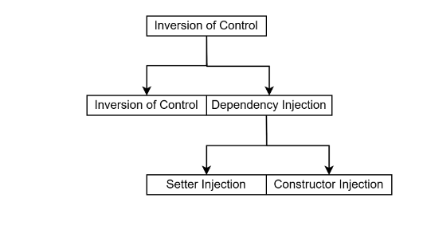

# 스프링 프레임워크 시작하기

스프링 웹 개발에 필요한 개발 환경을 구축한다.

개발 환경은 AWS EC2, Ubuntu OS, JDK, STS, Apache 서버, Tomcat 서버, MariaDB 순으로 설치한다.

## 개발 환경 구축

### JDK 설치

JDK는 오라클 홈페이지에 접속하면 무료로 내려받을 수 있다. JDK를 내려받을 수 있는 위치는 버전에 따라 다르기도 하고 URL 정보가 자주 변경되므로 구체적으로 기술하지는 않으나, 개발 환경의 버전을 알맞게 구성하는 것은 매우 중요한 일이다. 가급적 LTS 버전을 사용한다.

### STS 설치

STS는 Spring Legacy Project 생성을 위해 3.xx 버전을 설치한다.

### Apache, Tomcat 설치

* Apache2 루트 디렉토리 경로

  `/var/www/html`

* Tomcat10 루트 디렉토리 경로

  `/var/lib/tomcat10/webapps/ROOT`

### 데이터베이스 구축

DB는 Oracle DB를 사용할 것이다. 로컬에서 DB 서버에 원격으로 접속해서 개발을 진행한다.

```sql
CREATE TABLE USERS(
    ID              VARCHAR2(8) PRIMARY KEY,
    PASSWORD        VARCHAR2(8),
    NAME            VARCHAR2(20),
    ROLE            VARCHAR2(5)
);

INSERT INTO USERS VALUES('test', 'test123', '관리자', 'Admin');
INSERT INTO USERS VALUES('user1', 'user1', '홍길동', 'User');

CREATE TABLE BOARD(
    SEQ            NUMBER(5) PRIMARY KEY,
    TITLE          VARCHAR2(200),
    WRITER         VARCHAR2(20),
    CONTENT        VARCHAR2(2000),
    REGDATE        DATE DEFAULT SYSDATE,
    CNT            NUMBER(5) DEFAULT 0
);

INSERT INTO BOARD(SEQ, TITLE, WRITER, CONTENT) VALUES(1, '가입인사', '관리자', '잘 부탁드립니다...');
```

## 실습 프로젝트 생성

### 프로젝트 생성

1. File - New - Spring Legacy Project - Project name 설정 - Templates : 'Spring MVC Project' 선택 후 Next 버튼

2. 최상위 패키지를 지정하는 화면

   패키지 경로에 최소 세 개 이상의 패키지가 지정되어야 Finish 버튼이 활성화되고 프로젝트를 생성할 수 있다. 

   입력란에 "com.springbook.biz"라고 입력하고 Finish 버튼 클릭

### 프로젝트 설정 변경

STS를 이용하여 'Spring MVC Project' 프로젝트를 생성하면 JRE 버전도 맞지 않고 서버 라이브러리도 등록되지 않으므로 이를 적절히 변경해야 한다. 이클립스의 프로젝트 탐색창에서 Board Web 프로젝트를 선택한 상태에서 마우스 오른쪽 버튼을 클릭하여 맨 아래에 [Properties]를 선택한다.

우선 왼쪽에서 [Project Facets]를 선택하고 Java 버전을 설치한 버전으로 수정한다.

그리고 오른쪽에 [Runtimes] 탭을 선택하고 'Apache Tomcat' 버전을 설치한 버전으로 체크한 후에 Apply, OK 버튼을 누른다.

설정을 마치고 다시 왼쪽에서 Java Build Path를 클릭하고 Libraries 탭을 클릭하여 경로를 확인했을 때 BuildPath는 이전에 선택한 3가지가 있어야 한다.

프로젝트가 생성되고 나면 스프링 기반의 웹 프로젝트 수행에 필요한 기본 설정 파일들과 소스들이 자동으로 생성된다. 이 파일들을 정리해야 앞으로 진행할 실습이 의미가 있다. 우선 src/main/resources 소스 폴더에 log4j.xml 파일을 제외한 나머지(패키지, 폴더, 파일들)는 모두 삭제한다.

그리고 src/main/webapp/WEB-INF 아래에 있는 spring과 views 폴더도 삭제한다.

# 프레임워크 개요

## 프레임 워크 개념

### 프레임워크의 등장 배경

프레임워크의 사전적 의미는 뼈대 혹은 틀로서 이 의미를 소프트웨어 관점에서 접근하면 아키텍처에 해당하는 골격 코드다.

### 프레임워크의 장점

잘 만들어진 프레임워크를 사용하면 애플리케이션에 대한 분석, 설계, 구현 모두에서 재사용성이 증가하는데, 이를 통해 다음과 같은 장점들을 얻을 수 있다.

### 자바 기반의 프레임워크

자바 기반의 프레임워크는 대부분 오픈소스 형태로 제공된다. 따라서 별도의 라이선스나 비용을 지불하지 않고 누구나 사용할 수 있으며, 기존의 프레임워크를 이용하여 자신만의 프레임워크를 구축할 수도 있다.

대표적인 자바 기반의 프레임워크로는 다음과 같은 것들이 있다.

## 스프링 프레임워크

### 스프링 탄생 배경

스프링 프레임워크는 로드 존슨이 2004년에 만든 오픈소스 프레임워크다. 스프링 프레임워크가 등장하기 이전에 자바 기반의 엔터프라이즈 애플리케이션은 대부분 EJB(Enterprise Java Beans)로 개발되었다. 그러나 EJB 기술은 EJB 컨테이너가 제공하는 많은 기능과 나름의 장점에도 불구하고 다음과 같은 여러 문제점 때문에 개발자들로부터 외면받을 수밖에 없었다.

### 스프링 프레임워크의 특징

스프링의 특징을 한 줄로 서술하면, "IoC와 AOP를 지원하는 경량의 컨테이너 프레임워크"로 표현할 수 있다.

## IoC(Inversion of Control) 컨테이너

스프링 프레임워크를 이해하는 데 가장 중요한 개념이 컨테이너이다. 컨테이너의 개념은 스프링에서 처음 사용된 것은 아니며, 기존의 서블릿이나 EJB 기술에서 이미 사용해왔다. 그리고 대부분의 컨테이너는 비슷한 구조와 동작 방식을 가지고 있으므로 서블릿 컨테이너를 통해 스프링 컨테이너의 동작 방식을 유추해볼 수 있다.

다음과 같이 간단한 서블릿 클래스를 만들었다고 가정한다.

### 결합도(Coupling)가 높은 프로그램

결합도란 하나의 클래스가 다른 클래스와 얼마나 많이 연결되어 있는지를 나타내는 표현이며, 결합도가 높은 프로그램은 유지보수가 어렵다. 이 결합도와 유지보수 관계를 이해하기 위해서 간단한 실습을 진행한다.

BoardWeb 프로젝트 src/main/java 소스 폴더에 SamsungTV 클래스를 작성한다.

### 다형성 이용하기

결합도를 낮추기 위해서 다양한 방법을 사용할 수 있겠지만, 가장 쉽게 생각할 수 있는 것이 객체지향 언어의 핵심 개념인 다형성(Polymorphism)을 이용하는 것이다. 앞에서 작성한 프로그램을 다형성을 이용하여 수정해본다. 다형성을 이용하려면 상속과 메소드 재정의(Overriding), 그리고 형변환이 필요하며, 자바 같은 객체지향 언어는 이를 문법으로 지원한다.

### 디자인 패턴 이용하기

결합도를 낮추기 위한 또 다른 방법으로 디자인 패턴을 이용하는 방법이 있다. 앞에서 살펴본 다형성을 이용하는 방법은 메소드를 호출할 때 인터페이스를 이용함으로써 좀 더 쉽게 TV를 교체할 수 있었다. 하지만 이 방법 역시 TV를 변경하고자 할 때, TV 클래스 객체를 생성하는 소스를 수정해야만 한다.

# 스프링 컨테이너 및 설정 파일

대부분 IoC 컨테이너는 각 컨테이너에서 관리할 객체들을 위한 별도의 설정 파일이 있다. Servlet 컨테이너는 web.xml 파일에, EJB 컨테이너는 ejb-jar.xml 파일에 해당 컨테이너가 생성하고 관리할 클래스들을 등록한다.

스프링 프레임워크도 다른 컨테이너와 마찬가지로 자신이 관리할 클래스들이 등록된 XML 설정 파일이 필요하다. 스프링 컨테이너가 사용할 XML 파일은 앞에서 설치한 STS를 이용하면 간단하게 만들 수 있다.

## 스프링 IoC 시작하기

### 스프링 설정 파일 생성

BoardWeb 프로젝트의 src/main/resources 소스 폴더를 선택하고 마우스 오른쪽 버튼을 클릭한다. 그리고 new - Other 메뉴를 클릭하면 아래와 같은 화면이 나온다. 여기서 'Spring' 폴더에 있는 'Spring Bean Configuration File'을 선택하고 Next를 클릭한다.

### 스프링 컨테이너 구동 및 테스트

스프링 설정 파일을 작성했으면 이제 TV 객체를 테스트하는 클라이언트를 만든다.

### 스프링 컨테이너의 종류

스프링에서는 BeanFactory와 이를 상속한 ApplicationContext 두 가지 유형의 컨테이너를 제공한다. 먼저 BeanFactory는 스프링 설정 파일에 등록된 bean 객체를 생성하고 관리하는 가장 기본적인 컨테이너 기능만 제공한다. 그리고 컨테이너가 구동될 때 bean 객체를 생성하는 것이 아니라, 클라이언트의 요청(Lookup)에 의해서만 bean 객체가 생성되는 지연 로딩(Lazy Loading) 방식을 사용한다. 따라서 일반적인 스프링 프로젝트에서 BeanFactory를 사용할 일은 전혀 없다.

## 스프링 XML 설정

### beans 루트 엘리먼트

스프링 컨테이너는 bean 저장소에 해당하는 XML 설정 파일을 참조하여 bean의 생명주기를 관리하고 여러 가지 서비스를 제공한다. 따라서 스프링 프로젝트 전체에서 가장 중요한 역할을 담당하며, 이 설정 파일을 정확하게 작성하고 관리하는 것이 무엇보다 중요하다.

### import 엘리먼트

스프링 설정 파일 하나에 우리가 만든 모든 클래스를 bean으로 등록하고 관리할 수도 있다. 하지만 스프링 기반의 애플리케이션은 단순한 bean 등록 외에도 트랜잭션 관리, 예외처리, 다국어 처리 등 복잡하고 다양한 설정이 필요하다.

### bean 엘리먼트

스프링 설정 파일에 클래스를 등록하려면 bean 엘리먼트를 사용한다. 이때 id와 class 속성을 사용하는데, id 속성은 생략할 수 있지만 class 속성은 필수이다. class 속성에 클래스를 등록할 때는 정확한 패키지 경로와 클래스 이름을 지정해야 한다. 따라서 될 수 있으면 STS의 자동 완성 기능을 이용하여 클래스를 정확하게 등록하기를 권장한다.

### bean 엘리먼트 속성

1. init-method 속성

   Servlet 컨테이너는 web.xml 파일에 등록된 Servlet 클래스의 객체를 생성할 때 디폴트 생성자만 인식한다. 따라서 생성자로 Servlet 객체의 멤버변수를 초기화할 수 없다. 그래서 서블릿은 init() 메소드를 재정의(Overriding)하여 멤버변수를 초기화한다.

2. destroy-method 속성

   init-method와 마찬가지로 bean 엘리먼트에서 destroy-method 속성을 이용하여 스프링 컨테이너가 객체를 삭제하기 직전에 호출될 임의의 메소드를 지정할 수 있다. 

3. lazy-init 속성

   ApplicationContext를 이용하여 컨테이너를 구동하면 컨테이너가 구동되는 시점에 스프링 설정 파일에 등록된 bean들을 생성하는 즉시 로딩(pre-loading) 방식으로 동작한다. 그런데 어떤 bean은 자주 사용되지도 않으면서 메모리를 많이 차지하여 시스템에 부담을 주는 경우도 있다.

   따라서 스프링에서는 컨테이너가 구동되는 시점이 아닌 해당 bean이 사용되는 시점에 객체를 생성하도록 init-lazy 속성을 제공한다. 특정 bean을 등록할 때, lazy-init="true"로 설정하면 스프링 컨테이너는 해당 bean을 미리 생성하지 않고 클라이언트가 요청하는 시점에 생성한다. 결국, 메모리 관리를 더 효율적으로 할 수 있게 된다.

4. 프로그램을 개발하다 보면 개발자도 모르는 사이에 수많은 객체가 생성된다. 그런데 이 중에는 하나만 생성돼도 상관없는 객체들이 있다. 예를 들어 우리가 사용 중인 SamsungTV 클래스에는 price 같은 변수가 있어서 생성되는 객체들이 다른 가격을 가지는 것도 아니므로 SamsungTV 클래스는 하나의 객체만 생성돼도 된다.

# 의존성 주입

## 의존성 관리

### 스프링의 의존성 관리 방법

스프링 프레임워크의 가장 중요한 특징은 객체의 생성과 의존관계를 컨테이너가 자동으로 관리한다는 점이다. 이것이 바로 스프링 IoC(제어의 역행)의 핵심 원리이기도 하다. 스프링은 IoC를 다음 두 가지 형태로 지원한다.

* Dependency Lookup
* Dependency Injection



이 중에서 컨테이너가 애플리케이션 운용에 필요한 객체를 생성하고 클라이언트는 컨테이너가 생성한 객체를 검색(Lookup)하여 사용하는 방식을 Dependency Lookup이라고 한다. Dependency Lookup은 우리가 지금까지 컨테이너를 사용해왔던 방법이다. 하지만 Dependency Lookup은 실제 애플리케이션 개발 과정에서는 사용하지 않으며, 대부분 Dependency Injection을 사용하여 개발한다.

### 의존성 관계

의존성(Dependency) 관계란 객체와 객체의 결합 관계이다. 즉, 하나의 객체에서 다른 객체의 변수나 메소드를 이용해야 한다면 이용하려는 객체에 대한 객체 생성과 생성된 객체의 레퍼런스 정보가 필요하다.

## 생성자 인젝션 이용하기

스프링 컨테이너는 XML 설정 파일에 등록된 클래스를 찾아서 객체 생성할 때 기본적으로 매개변수가 없는 기본(Default) 생성자를 호출한다. 하지만 컨테이너가 기본 생성자 말고 매개변수를 가지는 다른 생성자를 호출하도록 설정할 수 있는데, 이 기능을 이용하여 생성자 인젝션(Constructor Injection)을 처리한다. 생성자 인젝션을 사용하면 생성자의 매개변수로 의존관계에 있는 객체의 주소 정보를 전달할 수 있다.

생성자 인젝션을 테스트하기 위해서 SamsungTV 클래스에 생성자를 추가한다.

### 다중 변수 매핑

생성자 인젝션에서 초기화해야 할 멤버변수가 여러 개이면, 여러 개의 값을 한꺼번에 전달해야 한다. 이때는 다음처럼 생성자를 적절하게 추가하면 된다.

### 의존관계 변경

지금까지는 SamsungTV 객체가 SonySpeaker를 이용하여 동작했지만 유지보수 과정에서 다른 스피커로 교체하는 상황도 발생할 것이다. 의존성 주입은 이런 상황을 매우 효과적으로 처리해준다.

실습을 위해 모든 스피커의 최상위 부모로 사용할 Speaker 인터페이스를 추가한다.

## Setter 인젝션 이용하기

생성자 인젝션은 생성자를 이용하여 의존성을 처리한다. 하지만 Setter 인젝션은 이름에서 알 수 있듯이 Setter 메소드를 호출하여 의존성 주입을 처리하는 방법이다. 두 가지 방법 모두 멤버변수를 원하는 값으로 설정하는 것을 목적으로 하고 있고, 결과가 같으므로 둘 중 어떤 방법을 쓰든 상관없다. 다만 코딩 컨벤션에 따라 한 가지로 통일해서 사용하는데 대부분은 Setter 인젝션을 사용하며, Setter 메소드가 제공되지 않는 클래스에 대해서만 생성자 인젝션을 사용한다.

### Setter 인젝션 기본

Setter 인젝션을 테스트하기 위해 SamsungTV 클래스에 Setter 메소드를 추가한다.

### p 네임스페이스 사용하기

Setter 인젝션을 설정할 때, 'p 네임스페이스'를 이용하면 좀 더 효율적으로 의존성 주입을 처리할 수 있다. p 네임스페이스는 네임스페이스에 대한 별도의 schemaLocation이 없다. 따라서 네임스페이스만 적절히 선언하고 사용할 수 있다.

## 컬렉션(Collection) 객체 설정

프로그램을 개발하다 보면 배열이나 List 같은 컬렉션(Collection) 객체를 이용하여 데이터 집합을 사용해야 하는 경우가 있다. 이때 컬렉션  객체를 의존성 주입하면 되는데, 스프링에서는 이를 위하여 컬렉션 매핑과 관련된 엘리먼트를 지원한다.

| 컬렉션 유형          | 엘리먼트  |
| -------------------- | --------- |
| java.util.List, 배열 | `<list>`  |
| java.util.Set        | `<set>`   |
| java.util.Map        | `<map>`   |
| java.util.Properties | `<props>` |

여러 컬렉션 중에서 List만 대표로 테스트하고 나머지는 간단한 설정 사례만 확인한다.

### List 타입 매핑

배열 객체나 java.util.List 타입의 컬렉션 객체는 `<list>` 태그를 사용하여 설정한다. 먼저 List 컬렉션을 멤버변수로 가지는 CollectionBean 클래스를 다음과 같이 작성한다.

### Set 타입 매핑

중복 값을 허용하지 않는 집합 객체를 사용할 때는 java.util.Set이라는 컬렉션을 사용한다. 컬렉션 객체는 `set` 태그를 사용하여 설정할 수 있다.

### Map 타입 매핑

특정 Key로 데이터를 등록하고 사용할 때는 java.util.Map 컬렉션을 사용하며, `<map>` 태그를 사용하여 사용하여 설정할 수 있다.

### Properties 타입 매핑

key=value 형태의 데이터를 등록하고 사용할 때는 java.util.Properties라는 컬렉션을 사용하며, `props` 엘리먼트를 사용하여 설정한다.

# 어노테이션 기반 설정

## 어노테이션 설정 기초

대부분 프레임워크가 그렇듯이 스프링 프레임워크 역시 XML 설정이 매우 중요하다. 그만큼 XML 파일의 과도한 설정에 대한 부담도 크며, 이로 인해 프레임워크 사용을 꺼리기도 한다. 따라서 대부분 프레임워크는 어노테이션을 이용한 설정을 지원하고 있다.

### Context 네임스페이스 추가

어노테이션 설정을 추가하려면 다음과 같이 스프링 설정 파일의 루트 엘리먼트인 `beans`에 Context 관련 네임스페이스와 스키마 문서의 위치를 등록해야 한다. 이는 p 네임스페이스를 추가했을 때처럼 [Namespaces] 탭을 선택하고 'context' 항목만 체그하면 간단하게 추가할 수 있다. 

### 컴포넌트 스캔(component-scan) 설정

스프링 설정 파일에 애플리케이션에서 사용할 객체들을 `<bean>` 등록하지 않고 자동으로 생성하려면 `<context:component-scan>`이라는 엘리먼트를 정의해야 한다. 이 설정을 추가하면 스프링 컨테이너는 클래스 패스에 있는 클래스들을 스캔하여 @Component가 설정된 클래스들을 자동으로 객체 생성한다.

### @Component

`<context:component-scan>`를 설정했으면 이제 스프링 설정 파일에 클래스들을 일일이 `<bean>` 엘리먼트로 등록할 필요가 없다. @Component만 클래스 선언부 위에 설정하면 끝난다. 예를 들어, LgTV 클래스에 대한 `<bean>` 등록을 XML 설정과 어노테이션 설정으로 처리하면 다음과 같다.

## 의존성 주입 어노테이션

### 의존성 주입 어노테이션

스프링에서 의존성 주입을 지원하는 어노테이션으로는 @Autowired, @Inject, @Qualifier, @Resource가 있다.

| 어노테이션 | 설명                                                         |
| ---------- | ------------------------------------------------------------ |
| @Autowired | 주로 변수 위에 설정하여 해당 타입의 객체를 찾아서 자동으로 할당한다.<br />org.springframework.beans.factory.annotation.Autowired |
| @Qualifier | 특정 객체의 이름을 이용하여 의존성 주입할 때 사용한다.<br />org.springframework.beans.factory.annotation.Qualifier |
| @Inject    | @Autowired와 동일한 기능을 제공한다.<br />javax.annotation.Resource |
| @Resource  | @Autowired와 @Qualifier의 기능을 결합한 어노테이션이다.<br />javax.inject.Inject |

이 중에서 @Autowired와 @Qualifier는 스프링에서 제공하지만, 나머지 어노테이션은 스프링에서 제공하지 않는다.

### @Autowired

@Autowired은 생성자나 메소드, 멤버변수 위에 모두 사용할 수 있다. 어디에 사용하든 결과가 같아서 상관없지만, 대부분은 멤버변수 위에 선언하여 사용한다. 스프링 컨테이너는 멤버변수 위에 붙은 @Autowired를 확인하는 순간 해당 변수의 타입을 체그한다. 그리고 그 타입의 객체가 메모리에 존재하는지를 확인한 후에, 그 객체를 변수에 주입한다.

그런데 만약 @Autowired가 붙은 객체가 메모리에 없다면 컨테이너가 NoSuchBeanDefinitionException을 발생시킨다. 다음 메시지는 @Autowired 대상 객체가 메모리에 존재하지 않는다는 의미이다.

### @Qualifier

문제는 의존성 주입 대상이 되는 Speaker 타입의 객체가 두 개 이상일 때 발생한다. 만약 SonySpeaker와 AppleSpeaker 객체가 모두 메모리에 생성되어 있는 상황이라면 컨테이너는 어떤 객체를 할당할지 스스로 판단할 수 없어서 에러가 발생한다. 이런 상황을 테스트하기 위해서 AppleSpeaker 클래스에도 @Component를 선언한다.

### @Resource

앞에서 살펴본 @Autowired는 변수의 타입을 기준으로 객체를 검색하여 의존성 주입을 처리하지만, @Resource는 객체의 이름을 이용하여 의존성 주입을 처리한다. @Resource는 name 속성을 사용할 수 있어서, 스프링 컨테이너가 해당 이름으로 생성된 객체를 검색하여 의존성 주입을 처리한다.

### 어노테이션과 XML 설정 병행하여 사용하기

스프링으로 의존성 주입을 처리할 때, XML 설정과 어노테이션 설정은 장단점이 서로 상충한다. 앞에서 살펴본 대로 XML 방식은 자바 소스를 수정하지 않고 XML 파일의 설정만 변경하면 실행되는 Speaker를 교체할 수 있어서 유지보수가 편하다. 하지만 XML 설정에 대한 부담 역시 존재한다. 그리고 자바 소스에 의존관계와 관련된 어떤 메타데이터도 없으므로 XML 설정을 해석해야만 무슨 객체가 의존성 주입되는지를 확인할 수 있다.

반면에 어노테이션 기반 설정은 XML 설정에 대한 부담도 없고, 의존관계에 대한 정보가 자바 소스에 들어있어서 사용하기는 편하다. 하지만 의존성 주입할 객체의 이름이 자바 소스에 명시되어야 하므로 자바 소스를 수정하지 않고 Speaker를 교체할 수 없다는 문제가 생긴다. 이런 문제를 서로의 장점을 조합하는 것으로 해결할 수 있는데, 다음 실습으로 확인해본다.

우선 LgTV 클래스의 speaker 변수를 원래대로 @Autowired 어노테이션만 설정한다.

## 추가 어노테이션

다음 그림은 시스템의 전체 구조를 두 개의 레이어로 표현한 것이다. 먼저 프레젠테이션 레이어는 사용자와의 커뮤니케이션을 담당하고, 비즈니스 레이어는 사용자의 요청에 대한 비즈니스 로직 처리를 담당한다.

# 비즈니스 컴포넌트 1

지금까지 스프링 프레임워크의 개념과 문법을 정리하면서 TV 예제를 사용했다. 그러나 TV예제는 문법을 확인하기 위해서 사용한 샘플이며, 실제 비즈니스 컴포넌트와는 거리감이 있을 수 있다. 이번 시간에는 일반적으로 프로젝트에서 사용하는 구조로 비즈니스 컴포넌트를 구현한 후, 스프링의 Dependency Lookup과 Dependency Injection을 점검해보도록 한다.

## BoardService 컴포넌트 구조

프로젝트마다 조금씩은 다르겠지만 일반적으로 비즈니스 컴포넌트는 네 개의 자바 파일로 구성된다. 그리고 각 자바 파일을 작성하는 순서와 이름 규칙도 어느 정도는 정해져 있는 것이 일반적이다. 이번에는 게시판 관련 컴포넌트를 구현하면서 비즈니스 컴포넌트의 작성 순서와 이름 규칙 등도 살펴본다.

## Value Object 클래스 작성

VO(Value Object) 클래스는 레이어와 레이어 사이에서 관련된 데이터를 한꺼번에 주목받을 목적으로 사용하는 클래스이다. DTO(Data Transfer Object)라 하기도 하는데, 데이터 전달을 목적으로 사용하는 객체이므로 결국 같은 의미의 용어라고 생각하면 된다.

VO 클래스를 작성하려면 가장 먼저 데이터베이스에 생성되어 있는 테이블의 구조를 확인해야 한다.

## DAO 클래스 작성

DAO(Data Access Object) 클래스는 데이터베이스 연동을 담당하는 클래스이다. 따라서 DAO 클래스에는 CRUD 기능의 메소드가 구현되어야 하는데, 이때 데이터베이스(Oracle이던, MariaDB이던)에서 제공하는 JDBC 드라이버가 필요하다.

### 드라이버 내려받기

BoardWeb 프로젝트에 있는 pom.xml 파일을 열고 다음과 같이 추가한다. `<dependencies>` 태그를 찾아서 바로 밑에 추가하면 된다.

### JDBC Utility 클래스

당분간 Mybatis 같은 프레임워크를 사용하기 전까지는 데이터베이스 연동 처리를 JDBC로 할 것이다. 따라서 모든 DAO 클래스에서 공통으로 사용할 JDBCUtil 클래스를 작성하여 Connection 획득과 해제 작업을 공통으로 처리하도록 한다.

### DAO 클래스 작성

앞에서 작성한 BoardVO 객체를 매개변수와 리턴타입으로 사용하면서 BOARD 테이블과 CRUD 기능을 처리할 BoardDAO 클래스를 다음과 같이 작성한다.

## Service 인터페이스 작성

DAO 클래스를 작성했으면 이제 DAO 클래스에서 Alt + Shift + T 단축키를 이용하여 BoardService 인터페이스를 작성한다. 이때 인터페이스가 만들어지는 동시에 BoardDAO 클래스에는 implements 코드가 자동으로 설정되는데, 이 implements 코드는 삭제해야 한다. 클래스 다이어그램을 확인해보면 알겠지만 BoardService 인터페이스는 BoardServiceImpl 클래스가 구현해야 하고, BoardDAO 클래스는 독립된 클래스로 구현되어야 한다. 

## Service 구현 클래스 작성

이제 마지막으로 BoardService 인터페이스를 구현한 BoardServiceImpl 클래스를 구현하면 비즈니스 컴포넌트는 마무리된다. BoardServiceImpl 클래스의 비즈니스 메소드를 구현할 때, 멤버변수로 선언된 BoardDAO를 이용하면 된다. 

## BoardService 컴포넌트 테스트

### 스프링 설정 파일 수정

작성된 BoardService 컴포넌트를 스프링 기반으로 테스트하려면 우선 스프링 설정 파일에 `<context:component-scan>` 설정을 수정한다.

### 클라이언트 작성 및 실행

이제 마지막으로 스프링 컨테이너를 구동하고 BoardService 컴포넌트를 사용하는 클라이언트 프로그램을 다음과 같이 작성하여 글 등록 기능과 글 목록 검색 기능을 테스트한다.

# 비즈니스 컴포넌트 실습 2

BoardService 컴포넌트를 만들었으면 이제 회원 정보를 관리하는 UserService 컴포넌트를 추가로 개발한다. BoardService와 동일한 절차로 개발하면 되므로 큰 문제는 없을 것이다. 하지만 이번에는 어노테이션을 사용하지 않고, Setter 인젝션으로 의존성 주입을 처리하고 나서 어노테이션으로 변경하는 과정을 거칠 것이다.

## UserService 컴포넌트 구조

먼저 UserService 컴포넌트에 대한 클래스 다이어그램이다. BoardService보다 심플하게 구성되어 있다.

## Value Object 클래스 작성

VO(Value Object) 클래스를 작성하기 위해서 USERS 테이블의 구조를 확인한다.

## DAO 클래스 작성

JDBCUtil 클래스를 이용하여 UserDAO 클래스의 메소드를 구현한다. 다만 UserDAO 클래스에는 회원 정보 하나를 검색하는 getUser() 메소드만 구현하도록 한다.

## Service 인터페이스 작성

UserDAO 클래스에서 이클립스의 Alt + Shift + T 단축키를 이용하여 간단하게 UserService 인터페이스를 작성한다. 이때 BoardService와 마찬가지로 인터페이스가 만들어지는 동시에 UserDAO 클래스에 implements 코드가 자동으로 추가되는데, 이 implements 코드 역시 삭제한다.

## Service 구현 클래스 작성

이제 마지막으로 UserService 인터페이스를 구현하는 UserServiceImpl 클래스를 만들면 비즈니스 컴포넌트는 마무리된다.

## UserService 컴포넌트 테스트

작성된 UserService 컴포넌트를 테스트하기 위해서 우선 스프링 설정 파일인 applicationContext.xml에 UserServiceImpl와 UserDAO 클래스를 각각 `<bean>` 등록한다. 그리고 UserServiceImpl 클래스에서 UserDAO 객체를 의존성 주입하기 위한 `<propertty >`설정을 추가하면 설정은 마무리된다.

## 어노테이션 적용

Setter 인젝션 설정으로 테스트한 UserService 컴포넌트를 어노테이션 설정으로 변경한다. 우선 스프링 설정 파일에 Setter 인젝션 관련 설정을 모두 주석 처리하거나 삭제한다.

# 스프링 AOP

비즈니스 컴포넌트 개발에서 가장 중요한 두 가지 원칙은 낮은 결합도와 높은 응집도를 유지하는 것이다. 스프링의 의존성 주입(Dependency Injection)을 이용하면 비즈니스 컴포넌트를 구성하는 객체들의 결합도를 떨어뜨릴 수 있어서 의존관계를 쉽게 변경할 수 있다. 스프링의 IoC가 결합도와 관련된 기능이라면, AOP(Aspect Oriented Programming)는 응집도와 관련된 기능이라 할 수 있다.

## AOP 이해하기

엔터프라이즈 애플리케이션의 메소드들은 대부분 다음과 같이 복잡한 코드들로 구성되어 있다. 이 중에서 핵심 비즈니스 로직은 몇 줄 안 되고, 주로 로깅이나 예외, 트랜잭션 처리 같은 부가적인 코드가 대부분이다. 이런 부가적인 코드들로 인해서 비즈니스 메소드의 복잡도는 증가하고 결국 개발자를 지치게 한다.

## AOP 시작하기

이번에는 스프링의 AOP를 이용해서 핵심 관심과 횡단 관심을 분리해본다. 이 실습이 마무리되면 BoardServiceImpl 소스와는 전혀 무관하게 LogAdvice나 Log4jAdvice 클래스의 메소드를 실행할 수 있게 된다.

### 비즈니스 클래스 수정

먼저 앞에서 작성했던 BoardServiceImpl 클래스는 원래의 상태로 되돌린다.

### AOP 라이브러리 추가

본격적으로 AOP를 적용하기 위해서 우선 BoardWeb 프로젝트에 있는 pom.xml 파일을 수정하여 AOP 관련 라이브러리를 추가한다. 

### 네임스페이스 추가 및 AOP 설정

AOP 설정을 추가하려면 AOP에서 제공하는 엘리먼트들을 사용해야 한다. 따라서 스프링 설정 파일(applicationContext.xml)에서 [Namespace] 탭을 클릭하고 aop 네임스페이스를 추가한다.

### 테스트 및 결과 확인

이제 BoardServiceClient 프로그램을 실행하여 insertBoard()와 getBoardList() 메소드가 호출될 때 LogAdvice 클래스의 printLog() 메소드가 실행되는지 확인하면 된다.

# AOP 용어 및 기본 설정

## AOP 용어 정리

AOP를 제대로 사용하려면 AOP와 관련된 용어들을 정확하게 이해해야 한다. 지금부터 AOP에서 사용하는 용어들을 하나씩 정리해보자.

### 조인포인트(Joinpoint)

조인포인트는 클라이언트가 호출하는 모든 비즈니스 메소드로서, BoardServiceImpl이나 UserServiceImpl 클래스의 모든 메소드를 조인포인트라고 생각하면 된다. 조인포인트를 다음에 설명할 '포인트컷 대상' 또는 '포인트컷 후보'라고도 하는데, 이는 조인포인트 중에서 포인트컷이 선택되기 때문이다.

### 포인트컷(Pointcut)

클라이언트가 호출하는 모든 비즈니스 메소드가 조인포인트라면, 포인트컷은 필터링된 조인포인트를 의미한다. 예를 들어, 트랜잭션을 처리하는 공통 기능을 만들었다고 가정한다. 이 횡단 관심 기능은 등록, 수정, 삭제 기능의 비즈니스 메소드에 대해서는 당연히 동작해야 하지만, 검색 기능의 메소드에 대해서는 트랜잭션과 무관하므로 동작할 필요가 없다.

### 어드바이스(Advice)

어드바이스는 횡단 관심에 해당하는 공통 기능의 코드를 의미하며, 독립된 클래스의 메소드로 작성된다. 그리고 어드바이스로 구현된 메소드가 언제 동작할지 스프링 설정 파일을 통해서 지정할 수 있다.

예를 들어, 트랜잭션 관리 기능의 어드바이스 메소드가 있다고 가정하자. 이 어드바이스가 비즈니스 로직이 수행되기 전에 동작하는 것은 아무런 의미가 없다. 당연히 비즈니스 로직 수행 후에 트랜잭션을 커밋(commit) 또는 롤백(rollback) 처리하면 된다.

### 위빙(Weaving)

위빙은 포인트컷으로 지정한 핵심 관심 메소드가 호출될 때, 어드바이스에 해당하는 횡단 관심 메소드가 삽입되는 과정을 의미한다. 이 위빙을 통해서 비즈니스 메소드를 수정하지 않고도 횡단 관심에 해당하는 기능을 추가하거나 변경할 수 있다.

### 애스팩트(Aspect) 또는 어드바이저(Advisor)

Aspect Oriented Programming이라는 이름에서 알 수 있듯이 AOP의 핵심은 바로 애스팩트이다. 애스팩트는 포인트컷과 어드바이스의 결합으로서, 어떤 포인트컷 메소드에 대해서 어떤 어드바이스 메소드를 실행할지 결정한다. 이 애스팩트 설정에 따라 AOP의 동작 방식이 결정되므로 AOP 용어 중 가장 중요한 개념이라 할 수 있다.

다음은 우리가 지금까지 사용한 애스팩트 설정이며, 각 설정의 의미를 정확하게 해석할 수 있어야 한다.

### AOP 용어 종합

다음 그림은 지금까지 살펴본 AOP 용어들을 하나의 그림으로 표현한 것이다.

## AOP 엘리먼트

지금까지 AOP와 관련된 용어들을 살펴봤다면, 이제부터는 AOP와 관련된 다양한 설정을 살펴볼 것이다. 스프링은 AOP 관련 설정을 XML 방식과 어노테이션 방식으로 지원하는데, 우선 XML 설정을 먼저 확인하고 이후에 어노테이션 설정을 살펴보도록 한다.

### [aop:config] 엘리먼트

AOP 설정에서 `<aop:config>`는 루트 엘리먼트이다. 스프링 설정 파일 내에 `<aop:config>` 엘리먼트는 여러 번 사용할 수 있으며, `<aop:config>` 엘리먼트 하위에는 `<aop:pointcut>`, `<aop:aspect>` 엘리먼트가 위치할 수 있다. 다음 그림은 AOP 엘리먼트들의 포함 관계를 표현한 것이다.

### [aop:pointcut] 엘리먼트

`<aop:pointcut>` 엘리먼트는 포인트컷을 지정하기 위해 사용하며, `<aop:config>`의 자식이나 `<aop:aspect>`의 자식 엘리먼트로 사용할 수 있다. 그러나 `<aop:aspect>` 하위에 설정된 포인트컷은 해당 `<aop:aspect>`에서만 사용할 수 있다.

`<aop:pointcut>`은 여러 개 정의할 수 있으면, 유일한 아이디를 할당하여 애스팩트를 설정할 때 포인트컷을 참조하는 용도로 사용한다.

### [aop:aspect] 엘리먼트

애스팩트는 `<aop:aspect>` 엘리먼트로 설정하며, 핵심 관심에 해당하는 포인트컷 메소드와 횡단 관심에 해당하는 어드바이스 메소드를 결합하기 위해 사용한다. 에스팩트를 어떻게 설정하느냐에 따라서 위빙 결과가 달라지므로 AOP에서 가장 중요한 설정이라 할 수 있다.

### [aop:advisor] 엘리먼트

용어 정리에서 확인했듯이 `<aop:advisor>` 엘리먼트는 포인트컷과 어드바이스를 결합한다는 점에서 애스팩트와 같은 기능을 한다. 하지만 트랜잭션 설정 같은 몇몇 특수한 경우는 애스팩트가 아닌 어드바이저를 사용해야 한다. 간단한 예를 통해 애스팩트와 어드바이저를 사용하는 기준을 확인해보자.

AOP 설정에서 애스팩트를 사용하려면 어드바이스의 아이디와 메소드 이름을 알아야 한다. 다음 설정은 log라는 어드바이스 객체의 printLog() 어드바이스 메소드를 포인트컷과 결합하는 설정이다.

## 포인트컷 표현식

포인트컷을 이용하면 어드바이스 메소드가 적용될 비즈니스 메소드를 정확하게 필터링할 수 있는데, 이때 다양한 포인트컷 표현식을 사용할 수 있다. 포인트컷 표현식은 메소드처럼 생긴 execution 명시자를 이용하여, execution 명시자 안에 포인트컷 표현식을 기술한다. 전체적인 구조는 다음과 같다.

# 어드바이스 동작 시점

어드바이스는 각 조인포인트에 삽입되어 동작할 횡단 관심에 해당하는 공통 기능이며, 동작 시점은 각 AOP 기술마다 다르다. 스프링에서는 다섯 가지의 동작 시점을 제공한다.

| 동작 시점 | 설명                                                         |
| --------- | ------------------------------------------------------------ |
| Before    | 비즈니스 메소드 실행 전 동작                                 |
| After     | - After Returning : 비즈니스 메소드가 성공적으로 리턴되면 동작<br />- After Throwing : 비즈니스 메소드 실행 중 예외가 발생하면 동작(마치 try-catch 블록에서 catch 블록에 해당)<br />- After : 비즈니스 메소드가 실행된 후, 무조건 실행(try ~ catch ~ finally 블록에서 finally 블록에 해당) |
| Around    | Around는 메소드 호출 자체를 가로채 비즈니스 메소드 실행 전후에 처리할 로직을 삽입할 수 있음 |

## Before 어드바이스

Before 어드바이스는 포인트컷으로 지정된 메소드 호출 시, 메소드가 실행되기 전에 처리될 내용들을 기술하기 위해 사용된다. Before 어드바이스의 동작 시점을 그림으로 표현하면 다음과 같다.

## After Returning 어드바이스

After Returning 어드바이스는 포인트컷으로 지정된 메소드가 정상적으로 실행되고 나서, 메소드 수행 결과로 생성된 데이터를 리턴하는 시점에 동작한다. 따라서 비즈니스 메소드 수행 결과로 얻은 결과 데이터를 이용하여 사후 처리 로직을 추가할 때 사용한다. After Returning 어드바이스의 동작 시점을 그림으로 표현하면 다음과 같다.

## After Throwing 어드바이스

After Throwing 어드바이스는 포인트컷으로 지정한 메소드가 실행되다가 예외가 발생하는 시점에 동작한다. 따라서 예외 처리 어드바이스를 설정할 때 사용한다. After Throwing 어드바이스의 동작 시점을 그림으로 표현하면 다음과 같다.

## After 어드바이스

try-catch-finally 구문에서 finally 블록처럼 예외 발생 여부에 상관없이 무조건 수행되는 어드바이스를 등록할 때 After 어드바이스를 사용한다.

After 어드바이스의 동작 시점을 그림으로 표현하면 다음과 같다.

## Around 어드바이스

지금까지 비즈니스 메소드 실행 전이나 실행 후에 수행되는 어드바이스를 살펴봤다. 하지만 어떤 상황에서는 하나의 어드바이스가 비즈니스 메소드 실행 전과 후에 모두 동작하여 로직을 처리하는 경우도 있을 것이다. 이때 사용하는 어드바이스가 Around 어드바이스이다. Around 어드바이스의 동작 시점을 그림으로 표현하면 다음과 같다.

# JoinPoint와 바인드 변수

횡단 관심에 해당하는 어드바이스 메소드를 의미 있게 구현하려면 클라이언트가 호출한 비즈니스 메소드의 정보가 필요하다. 예를 들어, After Throwing 기능의 어드바이스 메소드를 구현한다고 가정한다. 이때, 예외가 발생한 비즈니스 메소드 이름이 무엇인지, 그 메소드가 속한 클래스와 패키지 정보는 무엇인지 알아야 정확한 예외 처리 로직을 구현할 수 있다. 스프링에서는 이런 다양한 정보들을 이용할 수 있도록 JoinPoint 인터페이스를 제공한다.

## JoinPoint 메소드

다음은 JoinPoint에서 제공하는 유용한 메소드들이다.

| 메소드                   | 설명                                                         |
| ------------------------ | ------------------------------------------------------------ |
| Signature getSignature() | 클라이언트가 호출한 메소드의 시그니처(리턴타입, 이름, 매개변수) 정보가 저장된 Signature 객체 리턴 |
| Object getTarget()       | 클라이언트가 호출한 비즈니스 메소드를 포함하는 비즈니스 객체 리턴 |
| Object[] getArgs()       | 클라이언트가 메소드를 호출할 때 넘겨준 인자 목록을 Object 배열로 리턴 |

## Before 어드바이스

Before 어드바이스는 비즈니스 메소드가 실행되기 전에 동작할 로직을 구현한다. 따라서 호출된 메소드 시그니처만 알 수 있으면 다양한 사전 처리 로직을 구현할 수 있다. 이때 Before 어드바이스 메소드의 매개변수로 JoinPoint를 선언한다.

클라이언트가 비즈니스 메소드를 호출할 때, 인자로 넘겨준 값들을 JoinPoint를 이용하여 출력하도록 BeforeAdvice 클래스를 수정한다.

## After Returning 어드바이스

After Returning은 비즈니스 메소드가 수행되고 나서, 결과 데이터를 리턴할 때 동작하는 어드바이스이다. 따라서 어떤 메소드가 어떤 값을 리턴했는지를 알아야 사후 처리 기능을 다양하게 구현할 수 있다. 기존에 작성했던 AfterReturningAdvice를 비즈니스 메소드가 리턴한 값을 이용하여 동작하도록 수정한다.

## After Throwing 어드바이스

After Throwing은 비즈니스 메소드가 수행되다가 예외가 발생할 때 동작하는 어드바이스이다. 따라서 어떤 메소드에서 어떤 예외가 발생했는지를 알아야 한다. 그래야 발생한 예외의 종류에 따라 정확한 예외 처리를 구현할 수 있을 것이다.

기존에 작성했던 AfterThrowingAdvice를 수정하여 예외가 발생한 메소드 이름과 발생한 예외 객체의 메시지를 출력하도록 수정한다.

## Around 어드바이스

Around 어드바이스는 다른 어드바이스와는 다르게 반드시 ProceedingJoinPoint 객체를 매개변수로 받아야 한다. ProceedingJoinPoint 객체는 비즈니스 메소드를 호출하는 proceed() 메소드를 가지고 있으며 JoinPoint를 상속했다.

# 어노테이션 기반 AOP

스프링 IoC를 학습하면서 XML 기반 설정과 어노테이션 기반 설정을 모두 사용했었다. 그리고 XML과 어노테이션 설정을 적절히 혼합하여 사용하면 XML 설정을 최소화하면서 객체들을 효율적으로 관리할 수 있었다. 스프링 AOP도 IoC와 마찬가지로 어노테이션 설정을 지원한다.

## 어노테이션 기반 AOP 설정

### 어노테이션 사용을 위한 스프링 설정

이번 시간에는 AOP 관련 어노테이션 종류와 기능에 대해서 살펴볼 것이다. AOP를 어노테이션으로 설정하려면 가장 먼저 스프링 설정 파일에 `<aop:aspectj-autoproxy>` 엘리먼트를 선언해야 한다.

### 포인트컷 설정

XML 설정에서 포인트컷을 선언할 때는 `<aop:pointcut>` 엘리먼트를 사용했다. 그리고 선언된 여러 포인트컷을 식별하기 위한 유일한 아이디를 지정했으며, 이후에 애스팩트 설정에서 특정 포인트컷을 참조할 수 있었다.

### 어드바이스 설정

어드바이스 클래스에는 횡단 관심에 해당하는 어드바이스 메소드가 구현되어 있다. 이 어드바이스 메소드가 언제 동작할지 결정하여 관련된 어노테이션을 메소드 위에 설정하면 된다. 어드바이스의 동작 시점은 XML 설정과 마찬가지로 다섯 가지가 제공된다.

이때 반드시 어드바이스 메소드가 결합될 포인트컷을 참조해야 한다. 포인트컷을 참조하는 방법은 어드바이스 어노테이션 뒤에 괄호를 추가하고 포인트컷 참조 메소드를 지정하면 된다.

### 애스팩트 설정

AOP 설정에서 가장 중요한 애스팩트는 @Aspect를 이용하여 설정한다. 애스팩트는 용어 정리 시간에 살펴봤듯이 포인트컷과 어드바이스의 결합이다. 따라서 @Aspect가 설정된 애스팩트 객체에는 반드시 포인트컷과 어드바이스를 결합하는 설정이 있어야 한다.

## 어드바이스 동작 시점

지금부터는 이전에 XML 기반으로 설정했던 각 어드바이스들을 어노테이션으로 변경해보도록 한다.

### Before 어드바이스

Before 어드바이스는 비즈니스 메소드가 실행되기 전에 공통으로 처리할 작업을 위해 사용한다. 앞에서 작성한 BeforeAdvice 클래스에 관련된 어노테이션을 추가한다.

### After Returning 어드바이스

After Returning 어드바이스는 비즈니스 메소드가 리턴한 결과 데이터를 다른 용도로 처리할 때 사용한다. 앞에서 작성한 AfterReturningAdvice 클래스에 관련된 어노테이션을 추가한다.

### After Throwing 어드바이스

After Throwing 어드바이스는 비즈니스 메소드 실행 도중에 예외가 발생했을 때, 공통적인 예외 처리 로직을 제공할 목적으로 사용하는 어드바이스이다. 앞에서 작성한 AfterThrowingAdvice 클래스에 관련된 어노테이션을 추가한다.

### After 어드바이스

After 어드바이스는 예외 발생 여부에 상관없이 무조건 수행되는 어드바이스로서 @After 어노테이션을 사용하여 설정한다. 이전에 작성했던 AfterAdvice 클래스를 다음과 같이 수정한다.

### Around 어드바이스 설정

Around 어드바이스는 하나의 어드바이스로 사전, 사후 처리를 모두 해결하고자 할 때 사용하며, @Around 어노테이션을 사용하여 설정한다.

### 외부 Pointcut 참조하기

XML 설정으로 포인트컷을 관리했을 때는 스프링 설정 파일에 포인트컷을 여러 개 등록했다. 그리고 애스팩트를 설정할 때 pointcut-ref 속성으로 특정 포인트컷을 참조할 수 있었기 때문에 포인트컷을 재사용할 수 있었다.

# 스프링 JDBC

## 스프링 JDBC 개념

JDBC는 가장 오랫동안 자바 개발자들이 사용한 DB 연동 기술이다. JDBC를 이용하여 DB 연동 프로그램을 개발하면 데이터베이스에 비종속적인 DB 연동 로직을 구현할 수 있다. 그런데 JDBC 프로그램은 이용하려면 개발자가 작성해야 할 코드가 너무 많다.

기존 UserDAO 클래스의 구성을 보자. 사용자가 입력한 아이디와 비밀번호와 매칭되는 회원 정보 하나를 조회하기 위해서 이렇게 많은 자바 코드를 사용해야 한다.

## JdbcTemplate 클래스

JdbcTemplate은 GoF 디자인 패턴 중 템플릿 메소드 패턴이 적용된 클래스이다. 템플릿 메소드 패턴은 복잡하고 반복되는 알고리즘을 캡슐화해서 재사용하는 패턴으로 정의할 수 있다. 템플릿 메소드 패턴을 이용하면 반복해서 사용되는 알고리즘을 템플릿 메소드로 캡슐화할 수 있어서 JDBC처럼 코딩 순서가 정형화된 기술에서 유용하게 사용할 수 있다. 따라서 반복되는 DB 연동 로직은 JdbcTemplate 클래스의 템플릿 메소드가 제공하고, 개발자는 달라지는 SQL 구문과 설정값만 신경 쓰면 된다.

## 스프링 JDBC 설정

### 라이브러리 추가

스프링 JDBC를 이용하려면 BoardWeb 프로젝트에 있는 pom.xml 파일에 DBCP 관련 `<dependency>` 설정을 추가해야 한다.

### DataSource 설정

JdbcTemplate 클래스가 JDBC API를 이용하여 DB 연동을 처리하려면 반드시 데이터베이스로부터 커넥션을 얻어야 한다. 따라서 JdbcTemplate 객체가 사용할 DataSource를 `<bean>` 등록하여 스프링 컨테이너가 생성하도록 해야 한다. 사실 DataSource 설정은 스프링 JDBC만을 위한 설정은 아니다. 이후에 테스트할 트랜잭션 처리나 Mybatis 연동, JPA 연동에서도 DataSource가 사용되므로 매우 중요한 설정이라 할 수 있다.

### 프로퍼티 파일을 활용한 DataSource 설정

PropperttyPlaceholderConfigurer를 이용하면 외부의 프로퍼티 파일을 참조하여 DataSource를 설정할 수 있다. 실습을 위해 src/main/resource 소스 폴더에 config 폴더를 생성하고 config 폴더에 database.properties 파일을 작성한다.

## JdbcTemplate 메소드

스프링 JDBC를 위한 기본 설정이 마무리됐으면 이제 JdbcTemplate 객체를 이용하여 DB 연동을 간단하게 처리할 수 있다.

### update() 메소드

INSERT, UPDATE, DELETE 구문을 처리하려면 JdbcTamplate 클래스의 update() 메소드를 사용한다. update() 메소드의 사용법은 "?"에 값을 설정하는 방식에 따라 크게 두 가지 형태가 있다. 

### queryForInt() 메소드

SELECT 구문으로 검색된 정수값을 리턴받으려면 queryForInt() 메소드를 사용한다. 매개변수의 의미는 앞에서 살펴본 update() 메소드와 같다.

### queryForObject() 메소드

queryForObject() 메소드는 SELECT 구문의 실행 결과를 특정 자바 객체(Value Object)로 매핑하여 리턴받을 때 사용한다. queryForObject() 메소드는 검색 결과가 없거나 검색 결과가 두 개 이상이면 예외(IncorrectResultSizeDataAccessException)를 발생시킨다.

그리고 중요한 것은 검색 결과를 자바 객체(Value Object)로 매핑할 RowMapper 객체를 반드시 지정해야 한다.

### query() 메소드

queryForObject()가 SELECT 문으로 객체 하나를 검색할 때 사용하는 메소드라면, query() 메소드는 SELECT 문의 실행 결과가 목록일 때 사용한다. 기본 사용법은 queryForObject() 메소드와 같다. 따라서 query() 메소드에서도 검색 결과를 VO 객체에 매핑하려면 RowMapper 객체를 사용한다.

## DAO 클래스 구현

스프링 JDBC를 이용하기 위한 모든 설정이 마무리됐으면, 이제 JdbcTemplate 객체를 이용하여 DAO 클래스만 구현하면 된다. 그런데 DAO 클래스에서 JdbcTemplate 객체를 얻는 방법은 두 가지이다.

### 첫 번째 방법 : JdbcDaoSupport 클래스 상속

첫 번째 방법은 JdbcDaoSupport 클래스를 상속하는 방법이다.

### 두 번째 방법 : JdbcTemplate 클래스 [bean] 등록, 의존성 주입

DAO 클래스에서 JdbcTemplate 객체를 얻는 두 번째 방법은 JdbcTemplate 클래스를 `<bean>` 등록하고, 의존성 주입으로 처리하는 것이다. 일반적으로 이 방법을 사용한다. 먼저 스프링 설정 파일에 JdbcTemplate 클래스를 `<bean>` 등록한다.

# 트랜잭션 처리

스프링과 비교되는 EJB는 모든 비즈니스 메소드에 대한 트랜잭션 관리를 EJB 컨테이너가 자동으로 처리해준다. 스프링에서도 EJB와 마찬가지로 트랜잭션 처리를 컨테이너가 자동으로 처리하도록 설정할 수 있는데, 이를 선언적 트랜잭션 처리라고 한다.

스프링의 트랜잭션 설정에서는 앞에서 학습한 AOP가 사용된다. 그런데 XML 기반의 AOP 설정만 사용할 수 있고, 어노테이션은 사용할 수 없다. 그리고 애스팩트를 설정하는 것도 `<aop:aspect>` 엘리먼트를 사용하지 못하고 `<aop:advisor>` 엘리먼트를 사용해야 한다. 이는 트랜잭션 관리에 사용되는 어드바이스가 독특하기 때문이다.

## 트랜잭션 네임스페이스 등록

스프링에서는 트랜잭션 관련 설정을 앞에서 살펴본 AOP로 처리한다. 그리고 추가로 트랜잭션을 제어하는 어드바이스를 설정하기 위해 스프링 설정 파일에 트랜잭션 관련 네임스페이스도 추가해야 한다. [Namespaces] 탭을 선택하고 tx 네임스페이스를 추가한다.

## 트랜잭션 관리자 등록

트랜잭션 관련 설정에서 가장 먼저 등록하는 것은 트랜잭션 관리자 클래스이다. 스프링은 다양한 트랜잭션 관리자를 지원하는데, 어떤 기술을 이용하여 데이터베이스 연동을 처리했느냐에 따라 트랜잭션 관리자가 달라진다. 그리고 모든 트랜잭션 관리자는 PlatformTransactionManager 인터페이스를 구현한 클래스들이다.

## 트랜잭션 어드바이스 설정

트랜잭션 관리 기능의 어드바이스는 `<tx:advice>` 엘리먼트를 사용하여 설정한다. 앞에서 트랜잭션 설정을 위한 tx 네임스페이스를 추가했으므로 다음과 같이 스프링 설정 파일에 `<tx:advice>` 엘리먼트를 이용하여 트랜잭션 관리 어드바이스를 설정한다.

## AOP 설정을 통한 트랜잭션 적용

트랜잭션 관리 어드바이스까지 설정했으면 비즈니스 메소드 실행 후에 트랜잭션 관리 어드바이스가 동작하도록 AOP 설정만 추가하면 된다. 이때 `<aop:aspect>` 엘리먼트를 사용하지 않고 `<aop:advisor>` 엘리먼트를 사용한다는 점이 기존 AOP 설정과 다르다. 우리는 앞에서 포인트컷과 어드바이스를 결합할 때 `<aop:aspect>` 엘리먼트를 사용했다.

## 트랜잭션 설정 테스트

지금까지 작성한 트랜잭션 관련 설정이 실제 트랜잭션 관리를 지원하는지 간단하게 테스트한다. 우선 BoardServiceClient에서 명시적으로 100번 글을 등록하도록 한다.

# Model 1 아키텍처로 게시판 개발

## Model 1 아키텍처 구조

90년대 말부터 2000년대 초까지 자바 기반의 웹 애플리케이션 개발에 사용됐던 아키텍처는 Model 1이다. Model 1 아키텍처는 JSP와 JavaBeans만 사용하여 웹을 개발하는 것으로 아래 그림과 같은 구조다.

Model 1 아키텍처에서 우선 살펴볼 것이 Model 기능의 JavaBeans다. 자바에서 Bean이라는 용어는 객체를 의미하므로 JavaBean하면 자바 객체를 의미한다. JavaBeans는 DB 연동에 사용되는 자바 객체들이다.

원래 Model의 정확한 의미는 DB 연동 로직을 제공하면서 DB에서 검색한 데이터가 저장되는 자바 객체다. 우리는 스프링 IoC와 AOP 관련 실습을 진행하면서 VO와 DAO 클래스를 사용했으며, 이 VO, DAO 클래스가 바로 Model 기능의 자바 객체다.

Model 1 아키텍처에서는 JSP 파일이 가장 중요한 역할을 수행하는데, 이는 JSP가 Controller와 View 기능을 모두 처리하기 때문이다. 먼저 Controller 기능은 JSP 파일에 작성된 자바 코드를 의미한다. 하지만 JSP에 작성된 모든 자바 코드를 Controller라고 하지는 않는다. 일반적으로 Controller는 사용자의 요청 처리와 관련된 자바 코드를 의미하며 대부분 아래 표와 같은 코드들로 구성된다.

## 로그인 기능 구현

1. 로그인 화면

   게시판 사용자는 로그인을 성공해야 게시판 목록 화면을 볼 수 있다. 따라서 가장 먼저 로그인 기능을 개발한다. 우선 사용자에게 로그인 화면을 제공하기 위해서 login.jsp 파일을 만든다.

   앞으로 작성하는 모든 JSP 파일은 src/main 폴더에 있는 webapp 폴더에 등록해야 한다. 따라서 이클립스의 프로젝트 탐색 창에서 src/main/webapp 폴더를 선택하고, 마우스 오른쪽 버튼을 클릭하여 New - JSP File을 선택한다.

2. 로그인 인증 처리

   이제 사용자가 입력한 아이디 비밀번호를 추출하여 로그인을 처리하는 login_proc.jsp 파일을 작성한다.

## 글 목록 검색 기능 구현

로그인에 성공한 다음에는 글 목록 화면으로 이동한다. BOARD 테이블에서 게시글을 검색하여 글 목록 화면을 구성하는 geBoardList.jsp 파일을 작성한다.

## 글 상세 기능 구현

글 목록 화면에서 사용자가 클릭한 게시글을 조회하고, 조회된 게시글의 상세 화면을 제공하는 getBoard.jsp 파일을 작성한다.

## 글 등록 기능 구현

1. 글 등록 화면

   글 등록 기능은 먼저 insertBoard.jsp 파일을 생성하여 글 등록 화면을 구성한다.

2. 글 등록 처리

   사용자가 입력한 데이터를 DB의 BOARD 테이블에 저장하는 insertBoard_proc.jsp 파일을 다음과 같이 작성한다.

## 글 수정 기능 구현

글 수정을 위한 별도의 화면은 제공하지 않으며, 앞에서 작성한 글 상세 화면(getBoard.jsp)이 글 수정에 사용된다. 그런데 글 수정을 처리하려면 수정할 글의 제목과 내용뿐만 아니라 게시글 번호도 알아야 한다. 따라서 상세 화면을 출력할 때 form 태그 밑에 HIDDEN 타입의 input 태그를 추가하여 수정할 게시글 번호도 같이 전달될 수 있도록 수정해야 한다.

## 글 삭제 기능 구현

사용자가 상세 화면에서 글 삭제 링크를 클릭하면 deleteBoard_proc.jsp 파일에서 해당 게시글을 삭제 처리하면 된다. 이때 삭제할 게시글 번호를 deleteBoard_proc.jsp 파일에 알려줘야 하므로 deleteBoard_proc.jsp 뒤에 seq 파라미터 정보를 추가한다.

## 로그아웃 기능 구현

마지막으로 구현할 기능은 로그아웃이다. 사실 로그아웃은 세션과 관련된 작업으 처리해야 하는데, 이번 시간에는 단순히 로그아웃 요청에 대해서 연관된 세션을 종료하고, 메인 화면으로 이동하는 것으로 구현할 것이다.

로그아웃 처리를 위해 logout_pro.jsp 파일을 작성한다.

# Model 2 아키텍처로 게시판 개발

## Model 2 아키텍처 구조

우리는 이전 시간에 Model 1 아키텍처로 게시판 프로그램을 개발했다. 물론 게시판처럼 작고 단순한 시스템을 개발하거나 개발 인력이 충분하지 않을 때는 구조가 단순한 Model 1 아키텍처를 사용하기도 한다. 하지만 시스템의 규모가 크고 기능이 복잡한 엔터프라이즈 시스템을 개발한다면 Model 1 아키텍처는 적합하지 않다.

Model 1 아키텍처가 엔터프라이즈 시스템에 적합하지 않은 이유는 자바 로직과 화면 디자인이 통합되어 유지보수가 어렵기 때문이다. 자바 개발자 입장에서 JSP 파일에 자바 로직과 화면 디자인이 통합되어 있으면, 우선 수정할 자바 로직을 찾기부터가 쉽지 않다. 그리고 디자이너가 디자인을 변경할 때도 복잡한 자바 코드들 때문에 어려움을 느낄 수밖에 없다.

이런 Model 1 아키텍처의 문제를 해결하기 위해 고안된 웹 개발 모델이 Model 2 아키텍처, 즉 MVC 아키텍처다. Model 2 아키텍처에서 가장 중요한 특징은 Controller의 등장이며, 이 Controller는 서블릿 클래스를 중심으로 구현된다.

## Controller 구현하기

### 서블릿 생성 및 등록

Controller 기능을 수행하는 서블릿 클래스를 하나 추가하여 기존의 Model 1 기반으로 개발된 게시판 프로그램은 MVC 아키텍처로 변경하자. Controller에 해당하는 서블릿 클래스를 구현할 때 이클립스의 기능을 이용하면 좀 더 쉽게 작성할 수 있다.

### Controller 서블릿 구현

서블릿 클래스가 만들어질 때 자동으로 추가되는 주석들은 모두 제거하고 DispatcherServlet 클래스가 Controller 기능을 수행하도록 구현한다.

## 로그인 기능 구현하기

로그인 기능을 MVC로 변환하려면 login.jsp 파일의 form 엘리먼트의 action 속성값을 "login.do"로 수정한다. "*.do" 형태의 요청에 대해서만 DispatcherServlet이 동작하기 때문이다.

## 글 목록 검색 기능 구현하기

MVC 구조로 변경하는 데 가장 중요한 기능이 바로 글 목록 검색 기능이다. 우선 기존에 글 목록 화면을 처리했던 getBoardList.jsp 파일에서 Controller 로직에 해당하는 자바 코드를 DispatcherServlet으로 복사한다. 이때 요청 path가 "/getBoardList.do"일 때 실행되는 영역에 소스를 복사하면 된다.

## 글 상세 보기 기능 구현하기

글 목록 화면(getBoardList.jsp)에서 게시글 제목을 클릭하면 글 상세 화면(getBoard.jsp)이 출력됐었다. 이제는 상세 화면도 MVC 아키텍처로 변환해보자. 먼저 getBoardList.jsp 파일을 열어서 게시글 제목에 설정된 하이퍼링크를 수정한다.

## 글 등록 기능 구현하기

글 등록 기능을 MVC로 변환하려면 가장 먼저 insertBoard.jsp 파일을 수정한다. form 엘리먼트의 action 속성값을 "insertBoard.do"로 수정한다.

## 글 수정 기능 구현하기

글 수정 기능을 MVC로 변환하려면 getBoard.jsp 파일에서 form 태그의 action 속성값을 "updateBoard.do"로 수정하여 구현한다.

## 글 삭제 기능 구현하기

글 삭제 기능을 MVC로 변환하려면 가장 먼저 getBoard.jsp 파일에서 글 삭제 관련 링크를 "deleteBoard.do"로 수정한다. 그리고 글 목록 링크도 "getBoardList.do"로 함께 수정한다.

## 로그아웃 기능 구현하기

로그아웃 기능을 MVC로 변환하려면 우선 모든 페이지에서 "logout_proc.jsp"라는 링크를 모두 "logout.do" 링크로 수정해야 한다.

# 프레임워크 개발

## MVC 프레임워크 구조

지금까지 개발한 게시판 프로그램은 MVC 아키텍처를 적용하긴 했지만, DispatcherServlet 클래스 하나로 Controller 기능을 구현했다. 하지만 이렇게 하나의 서블릿으로 Controller를 구현하면 클라이언트의 모든 요청을 하나의 서블릿이 처리하게 된다. 따라서 수많은 분기 처리 로직을 가질 수밖에 없고, 이는 오히려 개발과 유지보수를 어렵게 만든다.

위 코드는 분기 처리 로직 대신 간단한 메시지를 출력하도록 했지만, 이전 시간에 우리가 완성한 DispatcherServlet 클래스는 훨씬 복잡하다. DispatcherServlet 클래스가 이렇게 복잡하게 구현되어 있으면 특정 기능을 수정하려고 할 때 코드를 찾는 것부터가 쉽지 않고, 새로운 기능을 추가할 때마다 분기 처리 로직은 계속 늘어나므로 복잡도는 계속 증가할 것이다.

결국, Controller를 서블릿 클래스 하나로 구현하는 것은 여러 측면에서 문제가 있으며, 다양한 디자인 패턴을 결합하여 개발과 유지보수의 편의성이 보장되도록 잘 만들어야 한다. 하지만 프레임워크에서 제공하는 Controller를 사용하면 우리가 직접 Controller를 구현하지 않아도 된다. 우리가 Struts나 Spring(MVC) 같은 MVC 프레임워크를 사용하는 이유는 바로 이런 프레임워크들이 효율적인 Controller를 제공해주기 때문이다.

우리가 최종적으로 적용할 Spring MVC는 DispatcherServlet을 시작으로 다양한 객체들이 상호작용하면서 클라이언트의 요청을 처리한다. 하지만 MVC 프레임워크에서 제공하는 Controller는 기능과 구조가 복잡해서 바로 적용하기가 어렵다.

따라서 본격적으로 Spring MVC를 적용하기 전에 Spring MVC와 동일한 구조의 프레임워크를 직접 구현하여 적용하려고 한다. 이런 단계를 거침으로써 Spring MVC의 구성 요소와 동작 원리를 더욱 쉽게 이해할 수 있을 것이다.

## MVC 프레임워크 구현

1. Controller 인터페이스 작성

   Controller를 구성하는 요소 중에서 DispatcherServlet은 클라이언트의 요청을 가장 많이 받아들이는 Front Controller이다. 하지만 클라이언트의 요청을 처리하기 위해 DispatcherServlet이 하는 일은 거의 없으며, 실질적인 요청 처리는 각 Controller에서 담당한다.

   구체적인 Controller 클래스들을 구현하기에 앞서 모든 Controller를 같은 타입으로 관리하기 위한 인터페이스를 만들어야 한다. 클라이언트의 요청을 받은 DispatcherServlet은 HandlerMapping을 통해 Controller 객체를 검색하고, 검색된 Controller를 실행한다. 이때 어떤 Controller 객체가 검색되더라도 같은 코드로 실행하려면 모든 Controller의 최상위 인터페이스가 필요하다.

2. LoginController 구현

   Controller 인터페이스를 구현한 LoginController 클래스를 만들고 다음과 같이 작성한다. 이때 DispatcherServlet 클래스에서 "/login.do"에 해당하는 소스를 복사하면 더욱 쉽게 구현할 수 있다.

3. HandlerMapping 클래스 작성

   HandlerMapping은 모든 Controller 객체들을 저장하고 있다가, 클라이언트의 요청이 들어오면 요청을 처리할 특정 Controller를 검색하는 기능을 제공한다. HandlerMapping 객체는 DispatcherServlet이 사용하는 객체이다. 따라서 DispatcherServlet이 생성되고 init() 메소드가 호출될 때 단 한 번 생성된다.

4. ViewResolver 클래스 작성

   ViewResolver 클래스는 Controller가 리턴한 View 이름에 접두사(prepix)와 접미사(suffix)를 결합하여 최종으로 실행될 View 경로와 파일명을 완성한다. ViewResolver도 HandlerMapping과 마찬가지로 DispatcherServlert의 init() 메소드가 호출될 때 생성된다.

5. DispatcherServlet 수정

   DispatcherServlet은 Front Controller 기능의 클래스로서 Controller 구성 요소 중 가장 중요한 역할을 수행한다. 지금부터 DispatcherServlet 클래스를 수정해야 하는데, 수정하기 전에 바탕화면이나 다른 곳에 복사본을 만들어놓아야 한다. 그래야 나중에 구체적인 Controller 클래스 구현에서 소스를 재사용할 수 있다.

## MVC 프레임워크 적용

1. 글 목록 검색 구현

   Controller 인터페이스를 구현한 GetBoardListController 클래스를 작성한다. 이때 다른 폴더에 복사했던 DispatcherServlet에서 글 목록 검색 관련 소스를 복사하면 쉽게 구현할 수 있다.

2. 글 상세 보기 구현

   Controller 인터페이스를 구현한 GetBoardController 클래스를 작성한다. 이때 DispatcherServlet에서 글 상세 조회 관련 소스를 복사하여 handleRequest() 메소드를 구현한다.

3. 글 등록 구현

   DispatcherServlet에서 글 등록 관련 소스를 복사하여 InsertBoardController 클래스를 작성한다.

4. 글 수정 구현

   DispatcherServlet에서 글 수정 관련 소스를 복사하여 UpdateBoardController 클래스를 작성한다.

5. 글 삭제 구현

   DispatcherServlet에서 글 삭제 관련 소스를 복사하여 DeleteBoardController 클래스를 작성한다.

6. 로그아웃 구현

   DispatcherServlet에서 로그아웃 관련 소스를 복사하여 LogoutController 클래스를 작성한다.

## EL/JSTL 이용한 JSP 화면 처리

우리가 Model 1 아키텍처를 Model 2, 즉 MVC로 변환했던 결정적인 이유는 JSP 파일에서 Controller 로직에 해당하는 자바 코드를 제거하기 위해서였다. 그런데 MVC 아키텍처가 적용된 BoardWeb 프로젝트에서 상세 화면과 목록 화면에 해당하는 getBoard.jsp와 getBoardList.jsp 파일을 보면 여전히 자바 코드가 남아있다.

사실 Controller 로직은 사용자 입력 정보 추출, DB 연동 처리, 화면 내비게이션 같은 자바 코드를 의미하기 때문에 현재 JSP 파일에 남아있는 자바 코드는 Controller 로직은 아니다. 만일 이런 자바 코드 조차도 JSP 파일에서 제거하고 싶다면, JSP에 제공하는 EL(Expression Language)과 JSTL(JSP Standard Tag Library)를 이용하면 된다. 지금부터 EL과 JSTL을 이용하여 JSP에서 자바 코드를 제거해보자.

1. 상세 화면(getBoard.jsp) 수정

   가장 먼저 게시글의 상세 정보를 출력하는 getBoard.jsp 파일에 EL을 적용하여 자바 코드를 제거한다.

2. 글 목록 화면(getBoardList.jsp) 수정

   게시글 목록을 출력하는 getBoardList.jsp 파일은 EL과 함께 for 루프로 처리하기 위한 JSTL도 같이 사용해야 한다.

# Spring MVC 구조

## Spring MVC 수행 흐름

Struts를 비롯한 대부분의 MVC 프레임워크는 비슷한 구조를 가졌다. 따라서 하나의 프레임워크만 잘 이해하면 다른 프레임워크도 쉽게 이해할 수 있다. 앞에서 Spring MVC와 구조가 같은 Controller를 만들어 게시판 프로그램에 적용했다. 따라서 지금부터 살펴볼 Spring MVC 구조가 전혀 새롭지는 않을 것이다.

아래 그림은 클라이언트의 요청을 시작으로 Spring MVC를 구성하는 각 요소가 어떻게 동작하는지를 표현했으며, 각 번호에 대한 설명을 아래에 추가했다. 그림의 번호와 설명을 번갈아 가며 확인하기 바란다.

## DispatcherServlet 등록 및 스프링 컨테이너 구동

### DispatcherServlet 등록

Spring MVC에서 가장 중요한 요소가 모든 클라이언트의 요청을 가장 먼저 받아들이는 DispatcherServlet이다. 따라서 Spring MVC 적용에서 가장 먼저 해야할 일은 WEB-INF/web.xml 파일에 등록된 DispatcherServlet 클래스를 스프링 프레임워크에서 제공하는 DispatcherServlet으로 변경하는 것이다.

### 스프링 컨테이너 구동

클라이언트의 요청으로 DispatcherServlet 객체가 생성되고 나면 DispatcherServlet 클래스에 재정의된 init() 메소드가 자동으로 실행되어 XmlWebApplicationContext라는 스프링 컨테이너가 구동된다. XmlWebApplicationContext는 ApplicationContext를 구현한 클래스 중 하나이다. 하지만 XmlWebApplicationContext는 우리가 직접 생성하는 것이 아니라 DispatcherServlet이 생성한다.

### 스프링 설정 파일 등록

현재 상태에서는 DispatcherServlet이 스프링 컨테이너를 구동할 때 무조건 /WEB-INF/action-servlet.xml 파일을 찾아 로딩한다. 그런데 해당 위치에 action-servlet.xml 파일이 없어서 FileNotFoundException이 발생한다. DispatcherServlet은 Spring 컨테이너를 구동할 때, web.xml 파일에 등록된 서블릿 이름 뒤에 '-servlet.xml'을 붙여서 스프링 설정파일을 찾는다. 따라서 web.xml 파일에 등록된 DispatcherServlet 이름이 dispatcher였다면 '/WEB-INF/dispatcher-servlet.xml' 파일을 찾았을 것이다.

## 스프링 설정 파일 변경

DispatcherServlet은 자신이 사용할 객체들을 생성하기 위해서 스프링 컨테이너를 구동한다. 이때 스프링 컨테이너를 위한 설정 파일의 이름과 위치는 서블릿 이름을 기준으로 자동으로 결정된다. 하지만 필요에 따라서는 설정 파일의 이름을 바꾸거나 위치를 변경할 수도 있다. 이때 서블릿 초기화 파라미터를 이용하면 된다.

## 인코딩 설정

web.xml 파일에 DispatcherServlet 클래스를 등록했으면 마지막으로 인코딩 설정과 관련된 필터 클래스를 추가한다. 현재 상태에서 Spring MVC를 적용하여 글 등록이나 수정 기능을 구현하면 한글을 처리하지 못하고 깨진다. 이는 web.xml 파일에 등록된 DispatcherServlet 클래스를 우리가 만들지 않았기 때문이다.

앞에서 우리가 직접 작성한 DispatcherServlet 클래스에서는 POST 방식의 요청에 적절하게 인코딩 처리를 하고 있다.

# Spring MVC 적용

## Spring MVC 적용 준비

본격적으로 Spring MVC를 적용하기에 앞서 직접 개발했던 Controller 관련 파일들을 모두 삭제한다. 그리고 삭제된 클래스들을 스프링에서 제공하는 클래스로 교체하면서 자연스럽게 Spring MVC의 흐름과 문법을 정리할 것이다. 따라서 가장 먼저 BoardWeb 프로젝트에서 'com.springbook.view.controller' 패키지를 삭제해야 한다.

## 로그인 기능 구현

1. LoginController 구현

   로그인 기능은 기존에 작성한 LoginController 클래스를 다음과 같이 수정한다.

2. HandlerMapping 등록

   작성된 LoginController가 클라이언트의 "/login.do" 요청에 대해서 동작하게 하려면 스프링 설정 파일인 presentation-layer.xml에 HandlerMapping과 LoginController를 bean 등록해야 한다.

## 글 목록 검색 기능 구현

1. GetBoardListController 구현

   글 목록을 출력하기 위해서 기존에 사용하던 GetBoardListController 클래스를 수정한다. 

2. HandlerMapping 등록

   이제 GetBoardListController 객체가 "/getBoardList.do" 요청에 동작할 수 있도록, SimpleUrlHandlerMapping에 매핑 정보를 추가하면 된다.

## 글 상세 조회 기능 구현

1. GetBoardController 구현

   게시글 상세 조회 기능을 구현하기 위해서 GetBoardController를 다음과 같이 수정한다.

2. HandlerMapping 등록

   GetBoardController 객체가 "/getBoard.do" 요청에 동작할 수 있도록, SimpleUrlHandlerMapping에 매핑 정보를 추가한다.

## 글 등록 기능 구현

1. InsertBoardController 구현

   InsertBoardController 클래스를 수정한다.

2. HandlerMapping 등록

   InsertBoardController가 "/getBoard.do" 요청에 동작할 수 있도록, SimpleUrlHandlerMapping에 매핑 정보를 추가한다. 그리고 이후에 추가될 글 수정, 글 삭제, 로그아웃 관련 설정도 함께 처리한다.

## 글 수정 기능 구현

UpdateBoardController 클래스를 수정하여 글 수정 기능을 추가한다.

## 글 삭제 기능 구현

DeleteBoardController 클래스를 수정하여 글 삭제 기능을 추가한다.

## 로그아웃 기능 구현

사용자가 로그아웃 링크를 클릭했을 때 로그아웃 처리를 위해 LogoutController를 수정한다.

## ViewResolver 활용

우리는 스프링 설정 파일인 presentation-layer.xml에 HandlerMapping, Controller 클래스들을 bean 등록하여 Spring 컨테이너가 객체 생성하도록 하였다. 그런데 아직 적용하지 않은 한 가지 요소가 있는데 바로 ViewResolver다. ViewResolver를 이용하면 클라이언트로부터의 직접적인 JSP 호출을 차단할 수 있어서 대부분 웹 프로젝트에서 ViewResolver 사용은 거의 필수이다. ViewResolver 역시 여러 가지가 있지만 JSP를 View로 사용하는 경우에는 InternalResourceViewResolver를 사용한다.

우선 클라이언트 브라우저에서 JSP 파일을 직접 호출하면 어떤 문제가 발생하는지 확인해보자. 게시글 목록 화면을 제공하는 getBoardList.jsp 파일을 브라우저에서 직접 호출하면 오류는 발생하지 않지만, 다음처럼 아무 데이터도 출력되지 않는다.

글 목록 화면에 아무런 데이터도 출력되지 않는 것은 getBoardList.jsp 파일이 실행되기 전에 게시글 목록을 검색하는 GetBoardListController가 실행되지 않았기 때문이다. 따라서 사용자가 getBoardList.jsp 파일을 직접 호출하면, 에러가 발생하고 GetBoardListController부터 실행할 수 있도록 적절히 제어해야 하는데, 이때 ViewResolver를 이용하면 된다.

1. ViewResolver 적용

   먼저 /WEB-INF/board/ 폴더를 생성하고, 기존에 사용했던 목록 화면과 상세 화면에 해당하는 getBoardList.jsp와 getBoard.jsp 파일을 이동시킨다.

   WEB-INF 폴더는 절대 브라우저에서 접근할 수 없다. 이제 WEB-INF 폴더로 이동한 JSP 파일들은 절대 클라이언트 브라우저에서 접근할 수 없다. 하지만 InternalResourceViewResolver를 다음과 같이 설정하면 WEB-INF 폴더에 있는 JSP 파일을 View 화면으로 사용할 수 있다. 결과적으로 직접적인 JSP 호출을 차단하게 된다.

   다시 로그인 기능을 실행해보면 이전까지 잘 실행되던 프로그램이 실행되지 않을 것이다. 만약 로그인에 실패하면 '/WEB-INF/board/login.jsp.jsp'라는 파일을 실행하기 때문이다.

2. Controller 수정

   ViewResolver를 적용했을 때, ModelAndView 객체에 저장되는 View 이름은 ViewResolver 설정을 고려하여 등록해야 한다. 따라서 앞에서 작성한 LoginController 클래스의 화면 내비게이션 코드를 다음처럼 수정한다.

# 어노테이션 기반 MVC 개발

스프링은 어노테이션 기반 설정을 제공함으로써 과도한 XML 설정으로 인한 문제를 해결한다. Spring MVC도 스프링 설정 파일에 HandlerMapping, Controller, ViewResolver 같은 여러 클래스를 등록해야 하므로 어노테이션 설정을 최대한 활용하여 XML 설정을 최소화할 필요가 있다.

## 어노테이션 관련 설정

스프링 MVC에서 어노테이션을 사용하려면, 먼저 bean 루트 엘리먼트에 context 네임스페이스를 추가한다. 그리고 HandlerMapping, Controller, ViewResolver 클래스에 대한 bean 등록을 모두 삭제하고 context:component-scan 엘리먼트로 대체한다.

## @Controller 사용하기

기존에는 스프링 컨테이너가 Controller 클래스를 생성하게 하려면 Controller 클래스들을 스프링 설정 파일에 bean 등록해야 했다. 하지만 어노테이션을 사용하면 컨트롤러 클래스 모두를 일일이 bean 등록할 필요 없이, 다음의 예처럼 클래스 선언부 위에 "@Controller"를 붙이면 된다. 이는 스프링 설정 파일에 context:component-scan으로 스프링 컨테이너가 컨트롤러 객체들을 자동으로 생성하기 때문이다.

@Controller를 상속한 @Controller는 @Controller가 붙은 클래스의 객체를 메모리에 생성하는 기능을 제공한다. 하지만 단순히 객체를 생성하는 것에 그치지 않고, DispatcherServlet이 인식하는 Controller 객체로 만들어 준다.

만일 @Controller를 사용하지 않는다면, 다음의 예처럼 모든 컨트롤러 클래스는 반드시 스프링에서 제공하는 Controller 인터페이스를 구현해야 한다. 그리고 handleRequest() 메소드를 반드시 재정의하여 DispatcherServlet이 모든 Controller의 handleRequest() 메소드를 호출할 수 있도록 해야 한다.

하지만 이렇게 구현한 Controller는 스프링 프레임워크가 지향하는 POJO(Plain Old Java Object) 스타일의 클래스가 아니다. Controller를 POJO 스타일의 클래스로 구현하려면 우선 클래스 선언부에 있는 "implements Controller"를 제거하고 클래스 위에 "@Controller"를 선언해야 한다. 스프링 컨테이너는 @Controller가 선언된 객체를 자동으로 Controller 객체로 인식한다.

이제 글 등록 기능의 InsertBoardController 클래스를 POJO 스타일로 구현한다.

InsertBoardController 클래스 객체는 스프링 컨테이너가 자동으로 생성하고, Controller 객체로 인식한다. 그리고 중요한 것은 InsertBoardController가 POJO 클래스로 변경되었으므로 메소드 이름을 insertBoard, 리턴타입을 void, 매개변수를 HttpServletRequest로 변경할 수 있다.

## @RequestMapping 사용하기

앞에서처럼 @Controller를 클래스 위에 추가함으로써 InsertBoardController 객체를 생성하고 Controller로 인식하게 할 수는 있지만, 클라이언트의 "/insertBoard.do" 요청에 대해서 insertBoard() 메소드가 실행되도록 할 수는 없다. 기존에는 HandlerMapping을 이용하여 클라이언트의 요청을 매핑했었다.

스프링에서는 @RequestMapping을 이용하여 HandlerMapping 설정을 대체한다. 다음과 같이 @RequestMapping을 insertBoard() 메소드 위에 설정한다.

위 설정은 클라이언트로부터 "/insertBoard.do"라는 요청이 있을 때, insertBoard() 메소드를 매핑하겠다는 설정이다. 여기에서 @RequestMapping의 value 속성은 생략할 수 있으며, 특별한 경우가 아니면 대부분 생략한다.

그리고 이 설정은 다음과 같은 XML 설정 방식과 동일한 결과를 가져온다.

현재까지 작성한 내용으로 글 등록 기능을 테스트해본다. 먼저 DB가 구동하고 있는지 반드시 확인하고, 구동하고 있지 않다면 h2w.bat 파일을 실행하여 DB를 구동한다.

## 클라이언트 요청 처리

대부분 Controller는 사용자의 입력 정보를 추출하여 VO(Value Object) 객체에 저장한다. 그리고 비즈니스 컴포넌트의 메소드를 호출할 때 VO 객체를 인자로 전달한다.

사용자 입력 정보는 HttpServletRequest의 getParameter() 메소드를 사용하여 추출한다. 따라서 InsertBoardController를 위와 같이 작성하고 실행해도 글 등록 작업은 정상으로 처리된다. 문제는 사용자가 입력하는 정보가 많거나 변경되는 상황이다. 사용자 입력 정보가 많으면 그만큼의 자바 코드가 필요할 것이고, 입력 정보가 변경될 때마다 Controller 클래스는 수정되어야 한다.

하지만 Command 객체를 이용하면 이런 문제를 모두 해결할 수 있다. Command 객체는 Controller 메소드 매개변수로 받은 VO(Value Object) 객체라고 보면 된다. InsertBoardController 클래스의 insertBoard() 메소드를 Command 객체를 이용하여 구현한다.

insertBoard() 메소드의 매개변수로 사용자가 입력한 값을 매핑할 BoardVO 클래스를 선언하면, 스프링 컨테이너가 insertBoard() 메소드를 실행할 때 Command 객체를 생성하여 넘겨준다. 그리고 이때 사용자가 입력한 값들을 Command 객체에 세팅까지 해서 넘겨준다. 결과적으로 사용자 입력 정보 추출과 VO 객체 생성, 그리고 값 설정을 모두 컨테이너가 자동으로 처리하는 것이다.

# 어노테이션으로 게시판 프로그램 구현하기

우리는 앞에서 글 등록 기능을 통해 가장 기본적인 @Controller와 @RequestMapping 어노테이션 활용법을 살펴봤다. 이제 본격적으로 게시판 프로그램을 구현한다.

## 글 등록 기능 구현하기

앞에서 테스트한 InsertBoardController 클래스에서 리턴 타입과 매개변수를 수정한다.

우선 글 등록 처리가 성공한 후에는 글 목록을 출력해야 한다. GetBoardListController를 실행시키기 위해 리턴타입을 String으로 수정하고 "getBoardList.do"를 리턴한다. 그리고 사용자 입력값을 Command 객체로 받기 위해 BoardVO 클래스를 매개변수로 선언했고, DB 연동 처리를 위해 BoardDAO도 매개변수로 선언했다. DAO 객체 역시 Command 객체와 마찬가지로 매개변수로 선언하면 스프링 컨테이너가 해당 객체를 생성하여 전달해준다.

## 글 목록 검색 구현하기

게시글을 등록한 후에 실행될 GetBoardListController 역시 @Controller, @RequestMapping을 이용하여 다음과 같이 구현한다.

getBoardList() 메소드는 세 개의 매개변수를 선언했는데, 첫 번째가 사용자 입력값을 받기 위한 BoardVO() 클래스이고, 두 번째가 DB 연동 처리를 위한 BoardDAO 클래스이다. 그리고 마지막으로 검색 결과와 화면 정보를 저장하여 리턴하기 위한 ModelAndView를 매개변수로 선언하여 컨테이너가 생성하도록 처리했다. 이제 게시글 등록 후에 글 목록 화면이 정상으로 출력되는지 확인해보면 된다.

## 글 상세 보기 구현하기

게시글 상세 보기 기능은 GetBoardListController와 유사하므로 이를 참조하여 구현하면 된다.

## 글 수정 기능 구현하기

게시글 수정 기능은 InsertBoardController와 유사하므로 이를 참조하여 구현하면 된다.

## 글 삭제 기능 구현하기

게시글 삭제 기능 역시 InsertBoardController나 UpdateBoardController와 유사하므로 둘 중 하나를 참조하여 구현하면 된다.

## 로그인 기능 구현하기

로그인 기능도 @Controller와 @RequestMapping 어노테이션을 이용하여 구현한다.

## 로그아웃 기능 구현하기

로그아웃 기능을 구현할 때는 세션 객체를 이용해야 한다.

## 컨트롤러 통합하기

어노테이션을 이용하여 Controller 클래스를 구현하면 대부분 4-5줄 내외로 간단하게 구현된다. 이렇게 간단하게 구현되는 Controller를 하나의 클래스로 묶어서 처리하면 관리가 더 편할 것이다. 따라서 BoardController 클래스를 새로 작성하여 앞에서 작성한 게시판 관련 Controller 클래스들을 하나로 통합한다.

## 요청 방식에 따른 처리

### method 속성

@RequestMapping을 이용하면 마치 Servlet처럼 클라이언트의 요청 방식(GET/POST)에 따라 수행될 메소드를 다르게 설정할 수 있다.

클라이언트가 GET 방식으로 입력 폼을 요청하면 입력 화면을 보여주고, 입력 화면에서 submit 버튼을 클릭하여 POST 방식으로 요청하면 클라이언트의 요청을 적절히 처리하고자 할 때 이 방법을 사용한다.

LoginController 클래스에 다음과 같이 loginView() 메소드를 추가하고 설정을 변경한다.

### JSP에서 Command 객체 사용

Command 객체에 저장된 데이터를 JSP에서 사용하려면 "${...}" 구문을 이용한다.

### @ModelAttribute 사용

스프링 컨테이너가 생성하는 Command 객체의 이름은 클래스 이름의 첫 글자를 소문자로 변경한 이름이 자동으로 설정된다. 따라서 login.jsp 화면에서 UserVO 객체의 변수에 접근할 때 "${userVO.변수명}"을 사용한 것이다. 그런데 Command 객체의 이름을 변경하려면 아래 표와 같이 @ModelAttribute를 사용해야 한다.

## Servlet API 사용

지금까지 Controller 메소드에서 사용자가 입력한 정보를 추출하기 위해서 HttpServletRequest 대신 Command 객체를 사용했다. 하지만 HttpServletRequest 객체가 사용자 입력값을 추출할 때만 사용되는 것은 아니다. HttpServletRequest 객체가 제공하는 다양한 메소드를 이용하여 Controller를 구현해야 할 때는 HttpSevletRequest 객체를 매개변수로 받아야 한다. 스프링 MVC에서는 Controller 메소드 매개변수로 다양한 Servlet API를 사용할 수 있도록 지원한다.

HttpSession 객체를 매개변수로 받아서 로그인 성공 시에 사용자 이름을 세션에 저장하고, 글 목록 화면에서 출력하도록 한다. 먼저 로그인에 성공할 때 사용자의 이름을 세션에 저장하기 위해서 LoginController 소스를 다음과 같이 수정한다.

## Controller의 리턴타입

Controller에 메소드를 정의할 때, 리턴타입은 개발자 마음대로 결정할 수 있으며, 지금까지 다양한 리턴타입을 사용하여 메소드를 구현했었다. 예를 들어, 리턴타입을 String으로 설정하면 완벽한 View 이름을 문자열로 리턴하겠다는 것이고, ModelAndView로 설정하면 검색된 Model 데이터와 View 이름을 모두 저장하여 리턴하겠다는 의미이다.

다음은 ModelAndView와 String을 리턴타입으로 사용한 경우를 비교한 것이다.

## 기타 어노테이션

### @RequestParam 사용하기

Command 객체를 이용하면 클라이언트에서 넘겨준 요청 파라미터 정보를 받아낼 수 있다. 하지만 이를 위해서는 반드시 요청 파라미터와 매핑될 변수와 Setter 메소드가 Command 클래스에 선언되어 있어야 한다. 그런데 Command 객체에는 없는 파라미터를 Controller 클래스에서 사용하려면 어떻게 해야 할까?

### @ModelAttribute 사용하기

우리는 앞에서 @ModelAttribute를 Controller 메소드의 매개변수로 선언된 Command 객체의 이름을 변경할 때 사용했었다. 이처럼 Command 객체의 이름을 변경할 목적으로 @ModelAttribute를 사용할 수 있지만, View(JSP)에서 사용할 데이터를 설정하는 용도로도 사용할 수도 있다.

### @SessionAttributes 사용하기

1. null 업데이트

   @SessionAttributes는 수정 작업을 처리할 때, 유용하게 사용할 수 있는 어노테이션이다. 예를 들어, 상세 화면에서 게시글을 수정한다고 가정해보자. 글 수정 버튼을 클릭하면 사용자가 입력한 수정 제목과 수정 내용 정보를 가지고 "/updateBoard.do" 요청을 전송할 것이고 BoardController의 updateBoard() 메소드에서는 사용자가 입력한 정보를 이용해서 글 수정 작업을 처리할 것이다. 그런데 문제는 사용자가 입력한 정보가 제목과 내용 뿐이고, 작성자(writer) 정보는 전달되지 않았기 때문에 Command 객체인 BoardVO에 writer 정보가 저장되지 않는다.

   물론 현재 상황에서는 BoardDAO에 updateBoard() 메소드가 제목과 내용 정보만 수정하도록 구현되어서 문제가 발생하지 않는다. 하지만 만약 다음처럼 작성자 컬럼까지 수정하도록 되어있다면 작성자(writer) 파라미터 정보가 전달되지 않으므로 WRITER 컬럼은 null로 수정된다.

   ```java
   private final String BOARD_UPDATE = "update board set title=?,
       								 writer=?, content=? where seq=?";
   ```

   이런 문제를 방지하기 위해 스프링에서는 @SessionAttribute 어노테이션을 제공한다. 우선 @SessionAttribute를 사용하기 전 상황을 살펴본다. BoardController 클래스에 updateBoard() 메소드에서 수정할 작성자 이름을 확인해보는 코드를 추가한다.

2. null 업데이트 방지

   이번에는 @SessionAttribute를 이용하여 writer 컬럼값이 null로 업데이트되지 않도록 처리한다. 먼저 BoardController 클래스를 다음과 같이 수정한다.

   수정된 소스를 저장하고 일단 실행 결과를 확인한다. 글 목록 화면에서 특정 게시글의 제목을 클릭하면 BoardController의 getBoard() 메소드가 실행되고 다음처럼 상세 화면이 출력될 것이다.

   이제 여기서부터가 중요한데 제목과 내용에 수정할 값을 입력하고 글 수정 버튼을 클릭하면 updateBoard() 메소드가 실행된다. 이때 콘솔에 사용자가 입력한 title, content 파라미터 정보뿐만 아니라 writer, regDate, cnt 파라미터 정보도 모두 설정된 것을 확인할 수 있다.

# 프레젠테이션 레이어와 비즈니스 레이어 통합

지금까지 Spring MVC를 기반으로 개발한 게시판 프로그램의 구조와 실행 순서를 다시 한 번 그림을 통해 확인해본다.

브라우저에서 버튼이나 하이퍼링크를 클릭하여 서버에 요청을 전송하면, 모든 요청을 서블릿 컨테이너가 생성한 DispatcherServlet이 받는다. 그리고 DispatcherServlet은 스프링 컨테이너가 생성한 Controller에게 요청을 전달하고, Controller는 매개변수를 통해 전달된 DAO 객체를 이용하여 사용자가 요청한 로직을 처리한다.

## 비즈니스 컴포넌트 사용

우리가 첫째 날 Spring IoC를 학습하면서 만들었던 비즈니스 컴포넌트는 VO 클래스, DAO 클래스, Servlet 인터페이스, Service 구현 클래스 등 네 개의 파일로 구성되어 있다. BoardService 컴포넌트에 대한 클래스 다이어그램을 다시 확인한다.

하지만 우리는 지금까지 게시판 프로그램을 구현하면서 BoardVO와 BoardDAO 클래스만 사용했지, BoardService 인터페이스나 BoardServiceImpl 클래스를 사용한 적은 없다. 그렇다면 사용하지도 않을 인터페이스와 서비스 구현 클래스는 왜 만들었을까?

1. DAO 클래스 교체하기

   Controller 메소드에서 DAO의 메소드를 호출하면 안 되는 첫 번째 이유는 유지보수 과정에서 DAO 클래스를 다른 클래스로 쉽게 교체하기 위해서이다. 지금은 BoardController의 모든 메소드가 BoardDAO 객체를 매개변수로 받아서 DB 연동을 처리하고 있다. 그런데 DAO 클래스를 기존에 우리가 만들었던 BoardDAOSpring으로 변경하거나 앞으로 추가될 다른 DAO 클래스를 변경하고자 한다면 BoardController의 모든 메소드를 수정해야 한다.

   그리고 BoardDAO 클래스를 사용하는 Controller가 BoardController 클래스 하나면 상관없지만, 여러 개라면 해당 클래스들을 모두 열어서 일일이 매개변수를 수정해야 한다. 이렇게 비즈니스 컴포넌트가 변경되거나 새로운 요소가 추가될 때마다 이를 사용하는 Controller의 소스를 매번 수정한다면 유지보수는 어려울 수밖에 없다.

   그러면 비즈니스 컴포넌트가 수정되더라도 이를 사용하는 Controller는 수정하지 않아도 되게끔 하려면 어떻게 해야 할까? 비즈니스 컴포넌트 입장에서 자신을 사용해주는 클라이언트는 Controller이다. 클라이언트가 인터페이스를 통해서 비즈니스 컴포넌트를 이용하면 컴포넌트의 구현 클래스를 수정하거나 다른 클래스로 대체해도 이를 사용하는 클라이언트는 수정하지 않아도 된다. 이것이 다형성의 장점이자 객체지향 언어의 중요한 특징이다.

   그러면 이제 BoardController의 모든 메소드를 BoardService 컴포넌트의 인터페이스를 이용하도록 수정해보자.

2. AOP 설정 적용하기

   Controller 메소드에서 DAO의 메소드를 호출하면 안 되는 두 번째 이유는 AOP 적용 때문이다. 우리는 둘째 날에 Spring AOP를 학습했고, 모든 비즈니스 컴포넌트의 메소드에서 공통으로 사용할 기능들을 횡단 관심, 즉 어드바이스로 구현했다. 그리고 이 어드바이스가 적절한 시점에 동작할 수 있도록 AOP 관련 설정을 XML이나 어노테이션으로 처리했다. 하지만 지금까지 게시판 프로그램을 개발하고 실행하면서 우리가 작성한 어드바이스들이 동작한 것을 본 적이 있었는가?

   횡단 관심에 해당하는 어드바이스가 동작하려면 Service 구현 클래스(BoardServiceImpl)의 비즈니스 메소드가 실행되어야 한다. 스프링 설정 파일에서 포인트컷 설정 부분을 다시 한번 체크한다.

   중요한 것은 포인트컷을 설정할 때 DAO 클래스의 메소드를 지정한 것이 아니라 Service 구현 클래스의 메소드에 설정했다는 것이다. 따라서 우리가 구현한 모든 어드바이스는 반드시 비즈니스 클래스의 메소드가 호출될 때 동작한다. 결국 Controller가 매개변수로 DAO 객체를 받아서 DAO의 메소드를 직접 호출하는 현재 상황에서는 AOP로 설정한 어떤 어드바이스도 동작할 수 없다.

   그러면 어떻게 해야 AOP 설정이 처리되어 어드바이스들이 동작할 수 있을까? 대부분 비즈니스 컴포넌트는 인터페이스를 가지고 있으며 이 인터페이스만 컴포넌트를 사용하는 클라이언트에 노출한다. 따라서 비즈니스 컴포넌트를 사용하는 클라이언트는 인터페이스의 추상 메소드를 호출하여 인터페이스를 구현한 Service 구현 객체의 메소드를 실행할 수 있다. 사실 Spring MVC를 적용하기 이전까지는 모든 실습에서 컴포넌트의 기능을 테스트할 때, 다음처럼 처리했기 때문에 어드바이스들이 동작할 수 있었던 것이다.

   따라서 Controller 클래스는 비즈니스 컴포넌트의 인터페이스 타입의 멤버변수를 가지고 있어야 하며, 이 변수에 비즈니스 객체를 의존성 주입해야 한다. 그러면 Controller 메소드에서는 인터페이스를 통해서 비즈니스 객체의 메소드를 호출할 수 있고 결국 AOP로 설정한 어드바이스들이 동작한다.

3. 비즈니스 컴포넌트 의존성 주입하기

   이제 지금까지 작성한 모든 파일을 저장하고 실행 결과를 확인하는 일만 남았다. 그런데 현재 상태에서 막상 실행해보면 다음과 같은 에러 메시지만 출력될 뿐 아무것도 동작하지 않는다.

   이 메시지는 BoardController가 @Autowired로 의존성 주입을 처리하려고 하는데, BoardService 타입의 객체가 메모리에 없어서 의존성 주입을 할 수 없다는 에러 메시지이다. @Autowired 어노테이션을 사용하려면 의존성 주입 대상이 되는 객체가 반드시 메모리에 올라가야 한다.

   결론은 BoardController보다 의존성 주입될 BoardServiceImpl 객체가 먼저 생성되어 있어야 하는 것이다 하지만 presentation-layer.xml 파일에는 다음과 같이 Controller 객체들만 컴포넌트 스캔하도록 설정했기 때문에 BoardServiceImpl 객체는 생성되지 않는다.

   결국, Controller보다 의존성 주입 대상이 되는 비즈니스 컴포넌트를 먼저 생성하려면 비즈니스 컴포넌트를 먼저 생성하는 또 다른 스프링 컨테이너가 필요하다. 그리고 이 컨테이너를 Controller를 메모리에 생성하는 컨테이너보다 먼저 구동하면 된다.

## 비즈니스 컴포넌트 로딩

### 2-Layered 아키텍처

일반적으로 프레임워크 기반의 웹 프로젝트를 보면 아래와 같이 두 개의 레이어로 나누어 시스템을 개발하는데, 이를 '2-Layered' 아키텍처 스타일이라고 한다.

우리는 이미 이런 구조로 게시판 프로그램을 개발했다. src/main/resources 소스 폴더에는 비즈니스 레이어에 해당하는 설정 파일인 applicationContext.xml이 있으며, /WEB-INF/config 폴더에는 프레젠테이션 레이어에 해당하는 설정 파일인 presentation-layer.xml이 있다.

DispatcherServlet이 생성되어 presentation-layer.xml 파일을 읽고 스프링 컨테이너를 구동하면 Controller 객체들이 메모리에 생성된다. 하지만 Controller 객체들이 생성되기 전에 누군가가 먼저 src/main/resources 소스 폴더에 있는 applicationContext.xml 파일을 읽어 비즈니스 컴포넌트들을 메모리에 생성해야 한다. 이때 사용하는 클래스가 스프링에서 제공하는 ContextLoaderListner다.

### ContextLoaderListner 등록

Listener는 Servlet이나 Filter 클래스와 마찬가지로 web.xml 파일에 등록한다. listener 태그 하위에 listener-class 태그를 이용하여 스프링에서 제공하는 ContextLoaderListner 클래스를 등록하면 된다.

중요한 것은 ContextLoaderListener 클래스는 서블릿 컨테이너가 web.xml 파일을 읽어서 구동될 때, 자동으로 메모리에 생성된다. 즉, ContextLoaderListner는 클라이언트의 요청이 없어도 컨테이너가 구동될 때 Pre-Loading 되는 객체다. 다음과 같이 web.xml 파일에 ContextLoaderListner 클래스를 등록하자.

### 스프링 컨테이너의 관계

모든 수정 내용을 저장하고 서버를 재구동하여 실행 결과를 확인한다. 그러면 아래처럼 총 세 개의 컨테이너가 구동되는 것을 확인할 수 있다.

톰캣 서버를 처음 구동하면 web.xml 파일을 로딩하여 서블릿 컨테이너가 구동된다. 그리고 서블릿 컨테이너는 web.xml 파일에 등록된 ContextLoaderListener 객체를 생성(Pre Loading)한다. 이때 ContextLoaderListener 객체는 src/main/resources 소스 폴더에 있는 applicationContext.xml 파일을 로딩하여 스프링 컨테이너를 구동하는데, 이를 'Root 컨테이너'라고 한다.

그리고 이때, Service 구현 클래스나 DAO 객체들이 메모리에 생성된다. 그리고 사용자가 로그인 버튼을 클릭하여 ".do" 요청을 서버에 전달하면 서블릿 컨테이너는 DispatcherServlet 객체를 생성하고 DispatcherServlet 객체는 /WEB-INF/config 폴더에 있는 presentation-layer.xml 파일을 로딩하여 두 번째 스프링 컨테이너를 구동한다. 이 두 번째 스프링 컨테이너가 Controller 객체를 메모리에 생성한다.

분명히 스프링 컨테이너는 두 개가 구동된다. 즉, ContextLoaderListener와 DispatcherServlet이 각각 XmlWebApplicationContext를 생성하는데, 이때 두 스프링 컨테이너의 역할과 기능이 다르다. 우선 ContextLoaderListener가 생성하는 스프링 컨테이너를 Root 컨테이너라고 하며, 쉽게 부모 컨테이너라고 생각하면 된다.

그리고 DispatcherServlet이 생성한 컨테이너를 Root 컨테이너가 생성한 객체를 이용하는 자식 컨테이너가 된다. 따라서 부모 컨테이너가 생성한 비즈니스 객체를 자식 컨테이너가 생성한 Controller에서 참조하여 사용할 수 있다.

이는 부모 컨테이너가 자식 컨테이너보다 먼저 구동되므로 당연한 결과이다.

# 검색 기능 추가 구현

지금까지 Spring MVC로 게시판 프로그램을 XML 방식과 어노테이션 방식으로 각각 구현했다. 이번에는 게시글 검색 기능을 구현해보도록 한다. 

## 검색 정보 추출

1. 검색 화면 구성

   먼저 검색 기능을 구현하기 위한 화면이 필요한데 검색 화면은 이미 getBoardList.jsp 파일에 구현되어 있다. 

   검색 화면에서 검색 조건과 검색 키워드에 해당하는 파라미터 이름은 searchCondition과 searchKeyword이다. searchCondition 파라미터값은 사용자가 검색 조건을 제목으로 선택했으면 "TITLE"이, 내용으로 선택했으면 "CONTENT"가 설정된다. 그리고 검색 키워드는 텍스트 필드이므로 사용자가 입력한 값이 직접 파라미터값으로 설정된다. 사용자가 이 두 정보를 적절하게 설정하고 검색 버튼을 클릭하면 사용자 입력값을 가지고 "/getBoardList.do" 요청을 서버에 전달한다.

2. Command 객체 수정

   "/getBoardList.do" 경로 요청이 서버에 전달되면 스프링 컨테이너는 BoardController에 getBoardList() 메소드를 실행한다. 이때, 사용자가 입력한 파라미터값들을 BoardVO라는 Command 객체에 자동으로 채운다.

   따라서 Command 객체로 사용할 BoardVO 클래스에 파라미터에 해당하는 멤버변수와 Getter/Setter 메소드를 추가해야 한다.

## Controller 구현

Command 객체로 사용할 BoardVO 클래스를 수정했으면 이제 비즈니스 컴포넌트를 호출하는 BoardController 클래스를 수정해야 한다. BoardController 클래스를 열어서 다음과 같이 수정한다.

클라이언트가 입력한 검색 조건과 검색 키워드 정보는 BoardVO 객체에 자동으로 설정되어 전달된다. 그런데 문제는 검색 조건과 검색 키워드가 전달되지 않을 때이다. 예를 들면 로그인에 성공하고서 "/getBoardList.do" 요청이 전달되거나 상세 화면에서 글목록 링크를 클릭하여 "/getBoardList.do" 요청을 서버에 전달하면 검색 조건과 검색 키워드 정보는 전달되지 않는다.

이때, BoardVO 객체의 searchCondition과 searchKeyword 변수에는 null이 설정된다. 따라서 이럴 때는 기본값을 적절하게 설정하여 비즈니스 컴포넌트에 전달해야 하므로 null 값에 대한 체크 로직을 추가했다.

## DAO 클래스 수정

BoardController 클래스를 수정했으면 이제 실질적으로 DB 연동 처리를 담당하는 DAO 클래스만 수정하면 된다. 현재 두 개의 DAO 클래스가 있으니 두 개 모두 수정한다.

1. BoardDAO 클래스 수정

   JDBC 기반으로 구현한 BoardDAO 클래스를 다음과 같이 수정한다.

   BoardDAO 클래스에서 가장 먼저 수정해야 할 코드는 SQL 명령어이다. 기존의 글 목록을 조회하는 쿼리(BOARD_LIST)는 BOARD 테이블의 모든 게시글을 조회하는 단일 쿼리였다. 따라서 검색 조건(searchCondition) 파라미터값이 TITLE이냐 CONTENT냐에 따라서 다른 쿼리가 동작할 수 있도록 두 개로 나눠야 한다. 그리고 제목이나 내용에 검색 키워드가 포함된 게시글 목록만 조회할 수 있도록 LIKE 연산자를 이용하여 조건절(WHERE)을 추가해야 한다.

   두 번째는 getBoardList() 메소드에 대한 수정이다. 매개변수로 받은 BoardVO 객체에 searchCondition 변숫값이 TITLE이냐 CONTENT냐에 따라서 적절한 쿼리문이 실행되도록 분기 처리 로직을 추가해야 한다. 그리고 어떤 쿼리가 실행되든 검색 키워드에 해당하는 '?'가 추가되기 때문에 searchKeyword 변숫값을 반드시 해당 물음표에 설정해야 한다.

2. BoardDAOSpring 클래스 수정

   Spring JDBC를 이용하여 DB 연동을 처리한 BoardDAOSpring 클래스도 다음과 같이 검색 기능이 동작하도록 수정한다.

   기본적인 코드 구성은 앞에서 살펴본 BoardDAO 클래스와 같다. 다만 검색 키워드를 설정하기 위해서 Object 배열을 사용한다는 것이 기존 소스와의 차이점이라 할 수 있다. 마지막으로 검색 기능을 테스트하기 위한 데이터를 몇 건 저장하고 검색 기능이 제대로 동작하는지 확인한다.

# 파일 업로드

웹 애플리케이션을 개발하다 보면 사용자가 자신의 로컬 PC에 있는 파일을 서버에 업로드해야 하는 때가 있다. 예를 들면 이력서를 등록하는 상황에서 증명사진을 이력서와 같이 업로드한다거나 쇼핑몰 시스템에서 신규 상품을 등록할 때 상품 이미지를 업로드할 수도 있을 것이다. 스프링에서는 이런 파일 업로드를 매우 간단하게 처리할 수 있도록 지원한다.

## 파일 업로드 처리

1. 파일 업로드 입력 화면

   게시판 프로그램에 파일 업로드 기능을 추가하기 위해서 글 등록 화면을 수정한다.

   글 등록 화면에서 파일을 업로드할 수 있게 만들기 위해서 form 태그에 enctype 속성을 추가하고, 속성값을 멀티파트 형식인 "multipart/form-data"로 지정해야 한다. 그리고 'file' 타입의 input 태그를 추가하여 서버에 업로드할 파일을 선택할 수 있도록 화면을 수정한다.

   이렇게 insertBoard.jsp 파일을 수정하고 나서 브라우저에서 글 등록 화면을 요청하면 다음처럼 파일을 업로드할 수 있는 화면이 제공된다. 글 등록 화면에서 찾아보기 버튼을 클릭하면 서버에 업로드할 파일을 선택할 수 있다.

2. Command 객체 수정

   파일 업로드를 추가하기 전에는 사용자가 입력한 데이터는 제목, 작성자, 내용뿐이었다. 하지만 이제 업로드할 파일 정보가 추가되었으므로 Command 객체로 사용하는 BoardVO에 파일 업로드와 관련된 변수를 추가해야 한다.

   BoardVO 클래스 파일을 열어 org.springframework.web.multipart.MultipartFile 타입의 uploadFile 변수를 추가하고 Getter/Setter 메소드를 적절한 위치에 생성해야 한다.

3. FileUpload 라이브러리 추가

   Apache에서 제공하는 Common FileUpload 라이브러리를 사용하여 파일 업로드를 처리하려면 먼저 FileUpload 라이브러리를 내려받기 위한 pom.xml 파일을 수정한다. pom.xml 파일을 열어 다음과 같이 dependency를 추가한다.

   기존에 설정했던 DBCP 아래에 FileUpload 관련 설정을 추가한다. 수정된 pom.xml 파일을 저장하고 반드시 메이븐(Maven)이 다음과 같이 두 개의 라이브러리(commons-fileupload-1.3.1.jar, commons-io-2.2.jar)를 추가했는지 확인한다.

4. MultipartResolver 설정

   파일 업로드 관련 라이브러리를 추가했다면 다음은 스프링 설정 파일에 CommonsMultipartResolver를 bean 등록해야 한다.

   이 설정이 매우 중요한 점이 있는데, 바로 CommonsMultipartResolver 클래스의 아이디(id)나 이름(name) 값이다. 지금까지 특정 클래스를 스프링 설정 파일에 bean 등록할 때, 참조할 Bean의 이름을 마음대로 등록했다. 다만 등록된 이름이 전체 스프링 설정 파일 내에서 유일한 이름이면 문제가 없었다.

   그런데 CommonsMultipartResolver 클래스는 그 이름이 정해져 있다. 정확하게는 DispatcherServlet이 특정 이름으로 등록된 CommonsMultipartResolver 객체만 인식하도록 프로그램되어 있다. 따라서 반드시 CommonsMultipartResolver의 아이디 값은 "multipartResolver"를 사용해야 한다. 그리고 더불어 이후에 스프링 설정 파일에 등록되는 클래스 중에서 이름이 "Resolver"로 끝나는 클래스들은 대부분 아이디가 정해져 있다. 따라서 이런 클래스들을 등록할 때는 조금 더 신경을 써야 한다.

   CommonsMultipartResolver 등록에서 maxUploadSize에 대한 Setter 인젝션은 업로드할 수 있는 파일의 크기를 제한하기 위한 설정이다. maxUploadSize를 지정하지 않으면 기본으로 "-1"이 설정되는데 이는 파일 크기가 무제한이라는 의미다.

   스프링을 이용한 파일 업로드 처리에서 CommonsMultipartResolver의 역할은 굉장히 중요하다. 클라이언트가 글 등록 화면에서 제목, 작성자, 내용, 파일 업로드 정보를 입력하고 글 등록 요청을 서버에 전송하면, CommonsMultipartResolver가 어떤 역할을 하는지 아래 그림을 통해 확인한다.

   1. 스프링 컨테이너는 BoardVO 객체를 생성한다.
   2. 네 개의 파라미터 정보를 추출하여 BoardVO 객체의 Setter 메소드들을 호출함으로써 사용자 입력값들을 설정한다.
   3. 값들이 설정된 BoardVO 객체를 insertBoard() 메소드를 호출할 때 인자로 전달한다.

   

## 예외 처리

클라이언트의 요청에 따라 Controller의 메소드가 실행되다 보면 예기치 못한 예외가 발생할 수 있다. 하지만 예외가 발생했을 때 사용자에게 적절한 메시지가 담긴 화면을 보여줘야지 500(Internal Server Error)번 에러 화면을 전송하는 것은 문제가 있다.

예를 들어 클라이언트가 로그인 요청을 전송할 때, 아이디를 입력하지 않으면 IllegalArgumentException이 발생한다고 가정하고 LoginController를 수정한다.

그러고 나서 로그인 화면에서 아이디 입력 없이 로그인 요청을 서버에 전송하면 아래와 같은 예외 화면이 클라이언트에 제공된다.

일반 사용자는 이런 메시지의 의미도 모를뿐더러 이런 식으로 예외를 내버려둬도 안 된다. 스프링에서는 이런 예외를 처리하기 위해 XML 설정과 어노테이션 설정 두 가지 방법을 제공한다.

### 어노테이션 기반의 예외 처리

스프링에서는 @ControllerAdvice와 @ExceptionHandler 어노테이션을 이용하여 컨트롤의 메소드 수행 중 발생하는 예외를 일괄적으로 처리할 수 있다. 먼저 presentation-layer.xml 파일에 예외 처리 관련 어노테이션 사용을 위한 설정을 추가한다.

### XML 기반의 예외 처리

스프링은 예외 처리를 어노테이션이 아닌 XML 설정 방식으로도 지원하는데, 이 방법이 조금 더 쉬운 방법이라 할 수 있다. 앞에서 처리한 어노테이션 기반의 설정과 개념은 같지만 CommonExceptionHandler처럼 예외 처리 클래스를 별도로 구현하지 않아도 되며, 단지 XML 설정만 처리하면 된다.

presentation-layer.xml 파일에 SimpleMappingExceptionResolver 클래스를 bean 등록하기만 하면 된다. 그리고 이전에 어노테이션 기반의 예외 처리에서 추가했던 설정은 모두 제거한다.

위 설정은 ArithmeticException이 발생하면 arithmeticError.jsp 화면이 사용자 브라우저에 전송되고, NullPointerException이 발생하면 nullPointerError.jsp 화면이 전송되면, 등록되지 않은 IllegalArgumentException이 발생하면 defaultErrorView로 설정한 error.jsp 화면이 전송된다. 설정을 저장하고 아이디 없이 로그인 요청을 서버에 전송한다. 실행 결과는 어노테이션 방식의 실행 결과와 같다.

# 다국어 처리

## 메시지 파일 작성하기

사용자가 원하는 언어로 메시지를 출력하면 각 언어에 따른 메시지 파일을 작성해야 한다. 기본적으로 메시지 파일의 확장자는 '.properties'이며, 파일명은 언어에 해당하는 Locale 정보를 결합하여 작성한다.

우선 영어와 한글 두 개의 언어를 지원하기 위해 두 개의 메시지 파일을 생성한다.

Properties 파일을 만들 때는 일반 File로 만들면 된다. src/main/resources 소스 폴더에 message 패키지를 만들고, message 패키지에서 마우스 오른쪽 버튼을 클릭하여 New - Other을 선택한다. 새 파일 생성 창이 열리면 General 폴더에 File을 선택하고 Next 버튼을 클릭한 후에 파일 이름을 입력하고 Finish 버튼을 클릭한다.

### 영어 메시지 파일 작성

message 패키지에 만들어진 messageSource_en.properties 파일에 다음과 같이 영어 메시지를 프로퍼티로 등록한다.

### 한글 메시지 파일 작성

메시지 파일을 만들 때 프로퍼티값을 영어로 등록하는 것은 상관없지만, 한국어를 포함한 중국어, 일본어 등의 아시아권 언어를 사용할 때는 반드시 유니코드로 변환하여 등록해야 한다.

예전에는 JDK에 포함된 native2ascii.exe를 이용하여 별도로 변환 작업을 수행해야 했다. 하지만 지금은 직접 한글을 입력해도 된다.

따라서 다음처럼 messageSource_ko.txt 파일을 만들어 한글 메시지를 등록한다.

그러고 나서 작성된 messageSource_ko.txt 파일의 모든 내용을 복사하여 messageSource_ko.properties 파일에 붙여 넣으면 간단하게 한글 프로퍼티 파일을 만들 수 있다.

## MessageSource 등록

언어별로 메시지 파일을 작성했으면 이제 스프링 설정 파일에 이 메시지 파일들을 읽어 들이는 MessageSource 클래스를 bean 등록해야 한다.

ResourceBundleMessageSource 클래스를 bean 등록할 때, 주의사항 이름이 "messageSource"로 고정되어 있다는 것이다. 앞에서 몇몇 Resolver 클래스를 bean 등록할 때 고정된 아이디를 사용했던 것을 기억할 것이다. MessageSource도 마찬가지로 "messageSource"가 아닌 다른 이름으로 등록하면 ResourceBundleMessageSource 객체는 사용되지 않는다.

ResourceBundleMessageSource 객체는 언어별로 작성된 메시지 파일들을 읽어 들여야 하므로 setBasenames() 메소드를 통해서 메시지 파일들이 저장된 배열 객체를 넘겨줘야 한다. 그런데 문제는 src/main/resources 소스 폴더에 작성된 메시지 파일들이 정확하게 등록되어있지 않았다는 것이다.

상식대로라면 다음과 같이 정확한 파일 이름이 등록되어야 하는데 어쩐 일인지 확장자 '.properties'는 생략되었으며, 언어 정보에 해당하는 '_en', 'ko' 역시 생략되어 있다.

## LocalResolver 등록

웹 브라우저가 서버에 요청하면 브라우저의 Locale 정보가 HTTP 요청 메시지 헤더에 자동으로 설정되어 전송된다. 이때, 스프링은 LocaleResolver를 통해서 클라이언트의 Locale 정보를 추출하고, 이 Locale 정보에 해당하는 언어의 메시지를 적용한다.

스프링에서는 다음과 같이 네 개의 LocaleResolver를 지원하는데 만약 스프링 설정 파일에 LocaleResolver가 등록되어있지 않으면 기본으로 AcceptHeaderLocaleResolver가 적용된다.

## Locale 변경하기

특정 언어로 화면을 보다가 해당 화면의 언어를 변경하고 싶을 때가 있을 수 있다. 이를 위해 스프링에서 제공하는 것이 LocaleChangeInterceptor 클래스이다. 이는 HandlerInterceptor 인터페이스를 구현한 클래스로서, 스프링 설정 파일에 인터셉터로 등록해야 한다. 다음은 LocaleChangeInterceptor까지 등록된 스프링 설정 파일의 전체 내용이다.

## JSP 파일 작성

1. 로그인 화면 처리

   JSP 파일에서 메시지 파일에 등록한 메시지로 화면을 구성하려면 스프링에서 제공하는 태그 라이브러리를 이용해야 한다. 따라서 JSP 파일에 다음처럼 taglib 지시자를 반드시 선언해야 한다.

   그러고 나서 다음처럼 `<spring:message/>` 태그의 code 속성값으로 메시지 파일에 등록된 메시지 키를 등록하면 Locale에 해당하는 메시지를 출력할 수 있다.

   login.jsp 파일을 다음과 같이 수정하고 실행한다.

2. 글 목록 화면 처리

   Locale이 영어인 상태에서 로그인에 성공하면 글 목록 화면도 영어 화면으로 유지되어야 한다. 따라서 getBoardList.jsp 파일을 열어서 적절하게 수정하고 실행 결과를 확인한다.

# 데이터 변환

시스템이 복잡해지면서 다른 시스템과 정보를 주고받을 일이 발생하는데, 이때 데이터 교환 포맷으로 JSON을 사용할 수 있다. 검색한 글 목록을 JSON 형식의 데이터로 변환하여 브라우저에 출력한다.

## JSON으로 변환하기

지금까지 BOARD 테이블에 저장된 게시글 정보를 저장하기 위해서 BoardVO 객체를 사용했다. BoardVO 객체에 저장된 데이터를 JSON 데이터로 변환하면 다음과 같이 BoardVO 객체가 가진 각 변수와 변수에 저장된 값이 '키:값' 형태로 표현된다.

### Jackson2 라이브러리 내려받기

검색 결과를 JSON 데이터로 변환하려면 가장 먼저 jackson2 라이브러리를 내려받아야 한다. BoardWeb 프로젝트의 pom.xml 파일을 열어서 jackson2 라이브러리를 내려받을 수 있도록 `<dependency>`를 추가한다.

수정된 pom.xml 파일을 저장하고 다음과 같이 jackson2 라이브러리들이 Maven Dependencies에 추가되었는지 확인한다.

### HttpMessageConvertor 등록

일반적으로 브라우저에서 서블릿이나 JSP 파일을 요청하면, 서버는 클라이언트가 요청한 서블릿이나 JSP를 찾아서 실행한다. 그리고 실행 결과를 아래 그림처럼 Http 응답 프로토콜 메시지 body에 저장하여 브라우저에 전송한다. 그래서 브라우저는 항상 실행 결과 화면만 표시했던 것이다.

그런데 이 응답 결과를 HTML이 아닌 JSON이나 XML로 변환하여 메시지 body에 저장하려면 스프링에서 제공하는 변환기(Converter)를 사용해야 한다. 스프링은 HttpMessageConverter를 구현한 다양한 변환기를 제공하는데, 이 변환기를 이용하면 자바 객체를 다양한 타입으로 변환하여 HTTP 응답 보디에 설정할 수 있다.

### 링크 추가 및 Controller 수정

스프링 설정 파일을 수정했으면 이제 사용자가 JSON 형태로 글 목록을 요청할 수 있도록 index.jsp 파일에 링크를 추가한다.

### 실행 결과 확인

이제 수정된 모든 파일을 저장하고 실행 결과를 확인해보면 된다. 그런데 실행 결과를 브라우저에서 확인하려면 익스플로러가 아닌 크롬 브라우저에서 실행해야 한다. 이는 익스플로러는 버전에 따라서 JSON 데이터를 표시할 수 없기 때문이다.

크롬 브라우저에서 index.jsp 파일을 요청한 후에 '글 목록 변환 처리' 링크를 클릭하면 아래 그림처럼 JSON으로 변환된 결과를 확인할 수 있다.

## XML로 변환하기

### JAXB 2 설정 추가

1. BoardVO 클래스 수정

   다른 시스템과 정보를 주고받을 때, JSON을 사용하기도 하지만 XML을 사용하기도 한다. 우리가 최종적으로 변환하고자 하는 XML의 모습은 아래 그림과 같다.

2. BoardListVO 추가

   XML 문서는 반드시 단 하나의 루트 엘리먼트를 가져야 한다. BoardVO는 하나의 게시글 정보를 저장하려고 사용하는 객체이다. 하지만 우리는 여러 게시글 목록을 XML로 표현해야 하므로 BoardVO 객체 여러 개를 포함하면서 루트 엘리먼트로 사용할 또 다른 자바 클래스가 필요하다. 루트 엘리먼트로 사용할 BoardListVO 클래스를 다음과 같이 추가로 작성한다.

### Controller 수정

이제 마지막으로 BoardController 클래스에 dataTransform() 메소드만 수정하면 된다.

### 실행 결과 확인

우리는 앞에서 검색 결과를 JSON 형태로 변환하여 처리했었다. 이때 자바 객체를 JSON 응답 body로 변환해주는 MappingJackson2HttpMessageConferter를 설정 파일에 추가해야 하는데, 이를 `<mvc:annotation-driven>` 설정으로 대체했었다. 그런데 이 설정은 자바 객체를 XML 응답 보디로 변환할 때 사용하는 Jaxb2RootElementHttpMessageConverter 클래스도 같이 등록해준다. 따라서 이와 관련된 설정은 추가로 하지 않아도 된다.

# Mybatis 프레임워크 시작하기

Mybatis는 원래 Apache에서 Ibatis라는 이름의 프레임워크로 탄생하였으나, 2010년에 Ibatis가 Apache에서 탈되하여 Google로 넘어가면서 이름이 Mybatis로 변경되었다. Mybatis는 Ibatis로부터 파생되어서 기본 개념과 문법은 Ibatis와 거의 유사하다. 따라서 기존에 Ibatis를 사용해 본 경험이 있는 학습자라면 Mybatis도 쉽게 사용할 수 있을 것이다.

## Mybatis 프레임워크 특징

Mybatis 프레임워크의 가장 중요한 특징을 두 가지로 정리하자면 첫째는 한두 줄의 자바 코드로 DB 연동을 처리한다는 것이며, 둘째는 SQL 명령어를 자바 코드에서 분리하여 XML 파일에 따로 관리한다는 것이다. 이 두 가지가 기존에 우리가 사용하던 JDBC 기반의 DB 연동을 어떻게 개선하는지 살펴보자. 다음은 BoardDAO 클래스에 글 목록 검색 기능을 JDBC 기반으로 구현한 것이다.

## Java ORM Plugin 설치

## 프로젝트 생성

## VO(Value Object) 클래스 작성

XML 파일에 저장된 SQL 명령어에 사용자가 입력한 값들을 전달하고 실행 결과를 매핑할 VO 클래스를 작성한다. 기존에 게시판 프로그램에서 사용한 BoardVO 클래스와 같으므로 복사해서 사용해도 된다.

## SQL Mapper XML 파일 작성

SQL Mapper XML 파일은 Mybatis에서 가장 중요한 파일이다. 이 XML 파일에 DB 연동에 필요한 SQL 명령어들이 저장되기 때문이다. 이 XML 파일은 Java ORM 플러그인을 이용하여 간단하게 생성할 수 있다.

## Mybatis 환경설정 파일

Mybatis 환경설정 파일도 앞에서 설치한 Java ORM 플러그인을 사용하면 자동으로 생성할 수 있다. MybatisProject를 선택하고 마우스 오른쪽 버튼을 클릭한 후, New - Other 메뉴를 선택한다.

## SqlSession 객체 생성하기

지금까지 복잡한 Mybatis 관련 설정 파일들을 작성했는데 사실 Mybatis를 처음 접하는 개발자에게는 이런 설정이 잘 이해도 안 되고 특별한 장점을 느끼지도 못할 것이다. 이것은 아직 SQL을 외부의 XML 파일에 따로 저장하는 것 정도만 처리했기 때문이다. 이제는 이 Mybatis 관련 설정을 기반으로 DAO 클래스를 구현해보도록 한다. 그러면 Mybatis의 장점을 더욱 확실히 느낄 수 있을 것이다.

Mybatis를 이용하여 DAO를 구현하려면 SqlSession 객체가 필요하다. 그런데 이 SqlSession 객체를 얻으려면 SqlSessionFactory 객체가 필요하다. 따라서 DAO 클래스를 구현하기에 앞서 SqlSessionFactory 객체를 생성하는 유틸리티 클래스를 작성해야 한다.

## DAO 클래스 작성

다음은 Mybatis를 이용하여 DB 연동을 처리하는 BoardDAO 클래스다.

## 테스트 클라이언트 작성 및 실행

다음은 BoardDAO 클래스의 메소드를 테스트하는 클라이언트 프로그램이다. src/test/java 소스 폴더에 클라이언트 프로그램을 작성하고 실행한다.

# Mapper XML 파일 설정

## SQL Mapper XML 기본 설정

### Mybatis 구조

Mybatis의 구조는 아래 그림과 같다. 

우선 SqlMapConfig.xml 파일은 Mybatis 메인 환경설정 파일이다. Mybatis는 이 파일을 읽어들여 어떤 DBMS와 커넥션을 맺을지, 어떤 SQL Mapper XML 파일들이 등록되어 있는지 알 수 있다.

Mybatis는 SqlMap.xml 파일에 등록된 각 SQL 명령어들을 Map 구조로 저장하여 관리한다. 각 SQL 명령어는 고유한 아이디 값을 가지고 있으므로 특정 아이디로 등록된 SQL을 실행 할 수 있다. 그리고 SQL이 실행될 때 필요한 값들은 input 형태의 데이터로 할당하고, 실행된 SQL이 SELECT 구문일 때는 output 형태의 데이터로 리턴한다.

### Mapper XML 파일 구조

Mybatis 프레임워크에서 가장 중요한 파일은 SQL 명령어들이 저장되는 SQL Mapper XML 파일이다. Mapper는 `<mapper>`를 루트 엘리먼트로 가지는 XML 파일이며, 아래 그림과 같은 기본 구조를 가진다.

Mapper 파일의 구조를 보면 가장 먼저 DTD 선언이 등장하고, 그 밑에 `<mapper>` 루트 엘리먼트가 선언된다. `<mapper>` 엘리먼트는 namespace 속성을 가지는데, 이 네임스페이스를 이용하여 더 쉽게 유일한 SQL 아이디를 만들 수 있다. 네임스페이스가 지정된 Mapper의 SQL을 DAO 클래스에서 참조할 때는 다음과 같이 네임스페이스와 SQL의 아이디를 결합하여 참조해야 한다.

Mapper 파일에 SQL 명령어들을 등록할 때는 SQL 구문의 종류에 따라 적절한 엘리먼트를 사용한다. INSERT 구문은 `<insert>` 엘리먼트를, SELECT 구문은 `<select>` 엘리먼트를 사용하는 식이다. 이때, 각 엘리먼트에서 사용할 수 있는 속성들이 다르므로 그 의미와 용도를 이해해야 한다.

### `<select>` 엘리먼트

`<select>` 엘리먼트는 데이터를 조회하는 SELECT 구문을 작성할 때 사용한다. `<select>` 엘리먼트에는 다음과 같이 parameterType과 resultType 속성을 사용할 수 있다.

1. id 속성

   `<select>` 엘리먼트에 선언된 id 속성은 필수 속성으로, 반드시 전체 Mapper 파일들 내에서 유일한 아이디를 등록해야 한다. 그래야 나중에 DAO 클래스에서 특정 아이디로 등록된 SQL을 실행할 수 있다. 이 id 속성과 관련하여 살펴볼 것이 루트 엘리먼트인 `<mapper>`이다. `<mapper>` 엘리먼트에 설정된 네임스페이스는 `<mapper>` 엘리먼트 안에서 선언된 여러 아이디를 하나의 네임스페이스로 묶을 수 있다.

   예를 들어, 다음 두 파일에 선언된 "getTotalCount"라는 아이디는 네임스페이스가 다르므로 다른 아이디로 처리될 수 있다.

2. parameterType 속성

   Mapper 파일에 등록된 SQL을 실행하려면 SQL 실행에 필요한 데이터를 외부로부터 받아야 한다. 이때 사용하는 속성이 parameterType 속성이다. parameterType 속성값으로는 일반적으로 기본형이나 VO 형태의 클래스를 지정한다.

3. resultType 속성

   검색 관련 SQL 구문이 실행되면 ResultSet이 리턴되며, ResultSet에 저장된 검색 결과를 어떤 자바 객체에 매핑할지 지정해야 하는데, 이때 사용하는 것이 resultType 속성이다.

### `<insert>` 엘리먼트

`<insert>` 엘리먼트는 DB에 데이터를 삽입하는 INSERT 구문을 작성하는 요소이다.

### `<update>` 엘리먼트

`<update>` 엘리먼트는 데이터를 수정할 때 사용되는 UPDATE 구문을 작성하는 요소이다.

### `<delete>` 엘리먼트

`<delete>` 엘리먼트는 데이터를 삭제할 때 사용되는 DELETE 구문을 작성하는 요소이다.

## SQL Mapper XML 추가 설정

### resultMap 속성 사용

검색 결과를 특정 자바 객체에 매핑하여 리턴하기 위해서 parameterType 속성을 사용한다. 그러나 검색 결과를 parameterType 속성으로 매핑할 수 없는 몇몇 사례가 있다. 예를 들어, 검색 쿼리가 단순 테이블 조회가 아닌 JOIN 구문을 포함할 때는 검색 결과를 정확하게 하나의 자바 객체로 매핑할 수 없다. 또는 검색된 테이블의 컬럼 이름과 매핑에 사용될 자바 객체의 변수 이름이 다를 때에 검색 결과가 정확하게 자바 객체로 매핑되지 않는다. 이럴 때 resultMap 속성을 사용하여 처리하면 된다.

resultMap 속성을 사용하려면 먼저 `<resultMap>` 엘리먼트를 사용하여 매핑 규칙을 지정해야 한다.

위 설정에서는 boardResult라는 아이디로 `<resultMap>`을 설정했다. `<resultMap>` 설정은 PK에 해당하는 SEQ 컬럼만 `<id>` 엘리먼트를 사용했고, 나머지는 `<result>` 엘리먼트를 이용하여 검색 결과로 얻어낸 컬럼의 값과 BoardVO 객체의 변수를 매핑하고 있다. 이렇게 설정된 `<resultMap>`을 getBoardList로 등록된 쿼리에서 resultMap 속성으로 참조하고 있다. 

### CDATA Section 사용

만약 SQL 구문 내에 '<' 기호를 사용한다면 다음처럼 에러가 발생한다.

이는 XML 파서가 XML 파일을 처리할 때 '<'를 '작다'라는 의미의 연산자가 아닌 또 다른 태그의 시작으로 처리하기 때문이다. 결국 Mapper 파일에 등록된 SQL 구문에서는 '<' 나 '>' 같은 기호를 사용하면 에러가 발생한다. 하지만 다음처럼 CDATA Section으로 SQL 구문을 감싸주면 에러는 사라진다.

CDATA Section은 Mybatis와는 상관없는 XML 고유의 문법으로서, CDATA 영역에 작성된 데이터는 단순한 문자 데이터이므로 XML 파서가 처리하지 않고 DB에 그대로 전달하므로 문제가 발생하지 않는다. 따라서 지금 당장은 아니더라도 나중에 '<' 나 '>'를 연산자로 사용할 것을 대비해 모든 SQL 구문을 CDATA Section으로 처리하는 것이다.

### SQL 대문자로 설정

Mapper 파일에 등록되는 SQL 구문은 일반적으로 대문자로 작성한다. 사실 SQL 구문은 대소문자를 구분하지 않는다. 따라서 어떻게 작성하든 상관없다. 하지만 파라미터들을 바인딩 할 때 대부분 칼럼명과 변수명이 같으므로 SQL 구문이 조금이라도 복잡해지면 이 둘을 구분하기가 쉽지 않다. 따라서 SQL은 모두 대문자로 표현하여 좀 더 식별성을 높인다. 다음 두 소스를 비교해보면 SQL 구문이 대문자로 표현된 것이 좀 더 보기 쉽다.

## Mybatis JAVA API

### SqlSessionFactoryBuilder 클래스

MyBatis Mapper 설정이 끝났으면 이제 남은 작업은 MyBatis 프레임워크에서 제공하는 API를 이용하여 DAO 클래스를 구현하는 것이다. MyBatis로 DAO 클래스의 CRUD 메소드를 구현하려면 Mybatis에서 제공하는 SqlSession 객체를 사용해야 한다. 그런데 SqlSession 객체는 SqlSessionFactory로부터 얻어야 하므로 가장 먼저 해야할 작업은 SqlSessionFactory 객체를 생성하는 일이다.

### SqlSessionFactory 클래스

SqlSessionFactory는 이름에서 알 수 있듯이 SqlSession 객체에 대한 공장 역할을 수행한다. SqlSessionFactory 객체는 openSession()이라는 메소드를 제공하며, 이 메소드를 이용해서 SqlSession 객체를 얻을 수 있다. 이렇게 얻어낸 SqlSession 객체를 통해 다음과 같이 글 등록 기능을 처리할 수 있다.

### 유틸리티 클래스 작성

Mybatis를 사용하여 DB 연동을 간단하게 처리하려면 최종적으로 Mybatis가 제공하는 SqlSession 객체를 사용해야 한다. 따라서 모든 DAO 클래스에서 좀 더 쉽게 SqlSession 객체를 획득할 수 있도록 공통으로 제공할 유틸리티 클래스를 만드는 것이다.

### SqlSession 객체

SqlSession 객체는 Mapper XML에 등록된 SQL을 실행하기 위한 다양한 API를 제공한다.

1. selectOne() 메소드

   selectOne() 메소드는 오직 하나의 데이터를 검색하는 SQL 구문을 실행할 때 사용한다. 따라서 getBoard() 같은 단 건 조회용 메서드를 구현할 때 사용할 수 있다. 쿼리가 한 개의 레코드만 리턴되는지를 검사하므로 만약 쿼리의 수행 결과로 두 개 이상의 레코드가 리턴될 때는 예외가 발생한다.

   * public Object selectOne(String statement)
   * public Object selectOne(String statement, Object parameter)

   selectOne() 메소드의 statement 매개변수는 Mapper XML 파일에 등록된 SQL의 아이디이다. 이때, SQL의 아이디를 네임스페이스와 결합하여 지정해야 한다. 그리고 실행될 SQL 구문에서 사용할 파라미터 정보를 두 번째 인자로 지정하면 된다.

2. selectList() 메소드

   selectList() 메소드는 여러 개의 데이터가 검색되는 SQL 구문을 실행할 때 사용한다. 매개변수의 의미는 selectOne() 메소드와 같다.

   * public List selectList(String statement)
   * public List selectList(String statement, Object parameter)

3. insert(), update(), delete() 메소드

   insert(), update(), delete() 메소드는 각각 INSERT, UPDATE, DELETE SQL 구문을 실행할 때 사용한다. 각각의 메소드는 실행된 SQL 구문으로 인해 몇 건의 데이터가 처리되었는지를 리턴한다.

   * public int insert(String statement, Object parameter)
   * public int update(String statement, Object parameterObject) throws SQLException
   * public int delete(String statement, Object parameterObject) throws SQLException

다음은 SqlSession 객체를 이용하여 구현한 BoardDAO 클래스의 전체 소스다.

# 스프링과 MyBatis 연동

Mybatis 프레임워크는 Ibatis에서 파생되었으므로 Mybatis의 전체적인 구조는 Ibatis와 매우 유사하다. 심지어 XML 설정 파일들과 자바 API까지도 Ibatis를 경험한 개발자에게 Mybatis를 이해하는 것은 그리 어렵지 않다.

## 라이브러리 내려받기

스프링과 Ibatis 프레임워크를 연동할 때는 스프링 쪽에서 Ibatis 연동을 위한 API를 지원했다. 다음은 스프링 프레임워크에서 제공하는 Ibatis 연동에 사용되는 클래스들이다.

* org.springfamework.orm.ibatis.SqlMapClientFactoryBean
* org.springfamework.orm.ibatis.SqlMapClientTemplate

그러나 Mybatis는 스프링 쪽에서 연동에 필요한 API를 제공하지 않으며, 오히려 Mybatis에서 스프링 연동에 필요한 API를 제공한다. 따라서 스프링과 Mybatis를 연동하려면 Mybatis에서 제공하는 다음과 같은 클래스들을 이용해서 연동해야 한다.

* org.mybatis.spring.SqlSessionFactoryBean
* org.mybatis.spring.SqlSessionTemplate

스프링과 Mybatis 연동에 필요한 라이브러리들을 내려받으려면 pom.xml 파일에 다음과 같은 `<dependency>`를 추가한다.

mybatis-3.3.1.jar 파일은 순수하게 Mybatis 관련 라이브러리고, mybatis-spring-1.2.4.jar 파일은 Mybatis와 스프링을 연동하기 위해 사용하는 라이브러리다.

## Mybatis 설정 파일 복사 및 수정

스프링과 Mybatis를 연동하려면 Mybatis 메인 환경설정 파일인 sql-map-config.xml과 SQL 명령어들이 저장되어 있는 Mapper 파일이 필요하다. 따라서 MybatisProject에서 작성했던 XML 설정 파일들을 복사하여 BoardWeb 프로젝트의 src/main/resources 소스 폴더에 추가 한다.

이 중에서 Mybatis 메인 환경설정 파일인 'sql-map-config.xml'을 열어서 다음과 같이 데이터 소스 관련 설정을 삭제한다.

데이터 소스는 스프링 프레임워크에서 이미 등록하여 사용하고 있었다. 그리고 이 데이터 소스는 DB 연동뿐만 아니라 트랜잭션 처리처럼 다양한 곳에서 사용할 수 있으므로 Mybatis 설정이 아닌 스프링 설정 파일에서 제공하는 것이 맞다. 그리고 SQL 명령어가 저장된 Mapper XML 파일은 수정 없이 그대로 재사용하면 된다.

## 스프링 연동 설정

스프링과 Mybatis를 연동하려면 우선 스프링 설정 파일에 SqlSessionFactoryBean 클래스를 Bean 등록해야 한다. 그래야 SqlSessionFactoryBean 객체로부터 DB 연동 구현에 사용할 SqlSession 객체를 얻을 수 있다.

MybatisProject에서는 SqlSession 객체를 얻기 위해 SqlSessionFactoryBean 클래스를 유틸리티 클래스로 직접 구현했었다. 하지만 이 클래스를 Mybatis에서 제공하므로 굳이 작성할 필요 없이 스프링 설정 파일에 `<bean>` 등록하면 된다.

SqlSessionFactoryBean 객체가 SqlSession 객체를 생산하려면 반드시 DataSource와 SQL Mapper 정보가 필요하다. 따라서 앞에 등록된 DataSource를 Setter 인젝션으로 참조하고, SQL Mapper가 등록된 sql-map-config.xml 파일도 Setter 인젝션으로 설정해야 한다. 그래야 `<bean>` 등록된 SqlSessionFactoryBean이 SqlSessionFactory 객체를 생성할 수 있다.

## DAO 클래스 구현 - 방법1

Mybatis를 이용하여 DAO 클래스를 구현하는 방법은 두 가지이다. 이 중에 첫 번째는 SqlSessionDaoSupport 클래스를 상속하여 구현하는 것이다.

SqlSessionDaoSupport 클래스를 상속한 후에 가장 먼저 한 작업이 setSqlSessionFactory() 메소드를 재정의한 것이다.

재정의한 setSqlSessionFactory() 메소드 위에 @Autowired를 붙였는데 이렇게 하면 스프링 컨테이너가 setSqlSessionFactory() 메소드를 자동으로 호출한다. 이때, 스프링 설정 파일에 `<bean>` 등록된 SqlSessionFactoryBean 객체를 인자로 받아 부모인 SqlSessionDaoSupport에 setSqlSessionFactory() 메소드로 설정해준다.

이렇게 해야 SqlSessionDaoSupport 클래스로부터 상속된 getSqlSession() 메소드를 호출하여 SqlSession 객체를 리턴받을 수 있다. 이제 SqlSession 객체의 CRUD 관련 메소드를 이용하여 DB 연동을 처리하면 된다.

## DAO 클래스 구현 - 방법2

Mybatis를 이용하여 DAO 클래스를 구현하는 두 번째 방법은 SqlSessionTemplate 클래스를 `<bean>` 등록하여 사용하는 것이다. 스프링 설정 파일에서 SqlSessionTemplate 클래스를 SqlSessionFactoryBean 아래에 `<bean>` 등록한다.

여기서 중요한 것은 SqlSessionTemplate 클래스에는 Setter 메소드가 없어서 Setter 인젝션할 수 없다는 것이다. 따라서 생성자 메소드를 이용한 Constructor 주입으로 처리할 수밖에 없다. 그러고 나서 DAO 클래스를 구현할 때, SqlSessionTemplate 객체를 @Autowired를 이용하여 의존성 주입 처리하면 SqlSessionTemplate 객체로 DB 연동 로직을 처리할 수 있다.

## MyBatis 연동 테스트

BoardDAOMybatis 객체를 의존성 주입할 수 있도록 BoardSeviceImpl 클래스를 다음과 같이 수정하고 테스트 클라이언트 프로그램을 실행하여 결과를 확인한다.

이때, src/test/java 소스 폴더에 있는 BoardServiceClient 프로그램을 실행하여 테스트할 수도 있고, index.jsp 파일을 실행하여 웹 애플리케이션으로 테스트할 수도 있다.

## Dynamic SQL으로 검색 처리

Mybatis는 SQL의 재사용성과 유연성을 향상시키고자 Dynamic SQL을 지원한다. Dynamic SQL을 사용하면 조건에 따라 다양한 쿼리를 DB에 전송할 수 있다.

1. Dynamic SQL 적용 전

   예를 통해 Dynamic SQL의 필요성을 확인하고 적용한다. 만약 현재 상태에서 검색 기능을 추가한다고 하면 우선 다음과 같이 두 개의 검색 관련 쿼리가 필요할 것이다.

   제목 검색과 내용 검색을 처리하기 위한 두 개의 쿼리를 등록했으면, 이제 DAO 클래스 getBoardList() 메소드에 검색 조건에 따른 분기 처리 로직을 추가한다.

   이제 수정된 파일들을 저장하고 index.jsp 파일을 실행한 후, 글 목록 화면에서 검색 기능을 실행해보면 정상적으로 실행될 것이다. 하지만 이런 방식으로 검색 기능을 구현한다면 이후에 추가되는 검색 조건에 대해서 많은 SQL 구문들을 반복해서 작성해야 할 것이고, 이는 결국 유지보수의 어려움으로 이어질 것이다. 그리고 DAO 클래스의 메소드 역시 검색 관련 SQL 구문의 개수만큼 분기 처리 로직을 추가해야 하므로 SQL이 추가될 때마다 DAO 클래스도 수정해야 한다.

2. Dynamic SQL 적용 후

   이런 SQL의 중복 문제를 해결하기 위해 Mybatis에서는 Dynamic SQL을 지원한다. Dynamic SQL을 이용하여 이런 문제가 어떻게 해결되는지 테스트한다.

   수정된 SQL 구문을 보면 `<if>`라는 동적 요소를 사용하여 조건에 따른 분기 처리를 하고 있다. 만약 searchCondition 변숫값이 'TITLE'을 가지고 있으면 제목 검색에 해당하는 조건이 추가되고, 'CONTENT'라는 값을 가지고 있으면 내용 검색에 해당하는 조건이 추가되어 실행된다. 이렇게 동적 엘리먼트를 이용하여 SQL을 처리할 수 있으므로 검색과 관련된 쿼리는 하나만 있으면 된다.

   그리고 당연히 이 SQL을 이용하여 검색 관련 DB 연동 로직을 처리하는 BoardDAOMybatis 클래스의 메소드 역시 원래의 코드를 유지할 수 없다. 이 코드는 새로운 검색 조건이 추가된다 하더라도 수정할 필요가 없다. 따라서 유지보수는 좀 더 편해질 것이다.

   수정된 모든 파일을 저장하고 검색 관련 기능이 동작하는지 테스트해보기 바란다.

# JPA 개념

## JPA의 특징

우리가 사용하는 대부분 프로그램은 사용자가 입력한 데이터나 비즈니스 로직 수행 결과로 얻은 데이터를 재사용할 수 있도록 데이터베이스에 저장한다. 하지만 자바의 객체와 데이터베이스의 테이블이 정확하게 일치하지 않는다. 따라서 둘 사이를 매핑하기 위해 많은 SQL 구문과 자바 코드가 필요할 수밖에 없다.

ORM(Object-Relation Mapping)은 이렇게 정확하게 일치하지 않는 자바 객체와 테이블 사이를 매핑해준다. 다시 말하면 ORM은 자바 객체에 저장된 데이터를 테이블의 Row 정보로 저장하고, 반대로 테이블에 저장된 Row 정보를 자바 객체로 매핑해준다. 이 과정에서 사용되는 SQL 구문과 자바 코드는 ORM 프레임워크가 자동으로 만들어준다.

우리는 지금까지 스프링 JDBC나 Mybatis를 이용하여 자바 객체와 테이블을 매핑해왔다. 하지만 어떤 DB 연동 기술이나 프레임워크를 사용하더라도 SQL 명령어를 자바 클래스나 외부의 XML 파일에 작성해야 했다. 그리고 이렇게 작성된 SQL은 유지보수 과정에서 지속적으로 수정되며 새로운 SQL이 추가되기도 한다. ORM 프레임워크의 가장 큰 특징이자 장점은 DB 연동에 필요한 SQL을 자동으로 생성한다는 것이다. 또한, 이렇게 생성되는 SQL은 DBMS가 변경될 때 자동으로 변경된다. 다만 ORM 환경설정 파일 어딘가에 DBMS가 변경되었다는 것만 수정해주면 된다.

사실 개발자들은 오래전부터 객체와 테이블 간의 불일치 때문에 발생하는 여러 문제점을 해결하기 위해 다양한 노력을 기울여왔다. 그 과정에서 등장한 것이 EJB의 EntityBean 기술이다. 하지만 EJB의 EntityBean은 기술적인 완성도가 높지 않아서 성능이나 복잡한 구현 등의 문제로 개발자로부터 외면당했다. 그러던 중 등장한 것이 Hibernate 프레임워크다. Hibernate는 완벽한 ORM 프레임워크이며 자바 객체와 테이블의 ROW를 매핑하는 역할을 수행한다.

이렇게 편리한 Hibernate는 오랜 시간을 거치면서 기능도 추가되고 성능도 향상되어 ORM의 대표 프레임워크가 되었다. 하지만 Hibernate 말고도 TopLink나 Cocobase 같은 다른 ORM 프레임워크들도 하나씩 등장하기 시작했다. 그래서 이런 ORM 프레임워크들에 대한 표준화 작업이 필요했고 그런 노력의 결과가 바로 JPA인 것이다.

## JPA의 특징

JPA(Java Persistence API)는 모든 ORM 구현체(ORM 프레임워크)들의 공통 인터페이스를 제공한다. JPA를 JDBC API와 비교하여 이해하면 편하다.

JDBC는 특징 DBMS에 종속되지 않는 DB 연동 구현을 지원한다. DB 연동 로직을 구현할 때, JDBC API(java.sql)의 인터페이스들을 이용하면 실질적인 DB 연동 처리는 해당 DBMS의 드라이버 클래스들이 담당하는 구조이다. 따라서 DBMS가 변경되는 상황에서도 드라이버만 변경하면 JDBC API를 이용하는 애플리케이션은 수정하지 않는다. 결국, 개발 당시에는 MySQL을 사용하다가 실제 서비스가 오픈될 때는 Oracle로 변경할 수도 있다.

JPA도 JDBC와 마찬가지이다. 애플리케이션을 구현할 때, JPA API(javax.persistence)를 이용하면 개발 당시에는 Hibernate를 ORM 프레임워크로 사용하다가 실제 서비스가 시작될 때는 TopLink로 변경할 수 있다.

## JPA 프로젝트 생성

JPA 프로젝트는 이클립스의 JPA Project 마법사를 이용해도 되지만, JPA Project는 추가로 설정해야 하는 것들이 있어서 일단은 Maven 기반으로 프로젝트를 생성하도록 한다.

일반 자바 프로젝트로 생성할 것이므로 기본인 'maven-archetype-quickstart'가 선택된 상태에서 Next 버튼을 클릭한다.

다음은 Maven 프로젝트 관련 설정 화면이다. 안내에 따라 적절하게 설정하고 Finish 버튼을 클릭하면 어느 정도 시간이 경과한 후에 프로젝트가 생성된다.

프로젝트가 생성되었을 때 JPE System Library 버전이 J2SE-1.5로 기본 설정되어 있다. 이를 수정하기 위해 JPA Project에서 마우스 오른쪽 버튼을 클릭하여 맨 아래에 있는 Properties를 선택한다.

우선 아래에 있는 'JPA' 항목을 체크한다. 그리고 오른쪽에 Runtimes 탭에서 'jdk1.8.0_73'을 체크한 후에 `<Apply>`, `<OK>` 버튼을 차례로 클릭하여 설정을 마무리한다.

그런데 `<Apply>` 버튼이 여전히 비활성화 되어있고  `<Apply>`  버튼 위에 문장이 "Further configuration required ..." 로 출력된다면 우선 해당 링크를 클릭한다.

JPA Facet 창이 열리면 JPA Implementation 항목에서 Type을 'Disable Library Configuration'으로 선택하고 `<OK>` 버튼을 클릭한다.

이 과정을 거치면 `<Apply>`와 `<OK>` 버튼이 활성화된다. 이렇게 Maven Project가 JPA 프로젝트로 변경되었으면 src/main/java 소스 폴더에 META-INF 폴더와 그 아래에 JPA 환경설정 파일인 persistence.xml이 생성된 것을 확인할 수 있다.

## JPA 라이브러리 내려받기

프로젝트에 JPA 관련 라이브러리들을 추가하기 위해서 pom.xml 파일을 수정한다. 

## JPA 시작하기

### 엔티티 클래스 매핑

JPA를 이용하는 간단한 프로젝트를 통해서 JPA를 구성하는 요소들이 어떤 것들이 있는지 확인해본다. 가장 먼저 할 일은 DB의 테이블과 매핑될 영속 클래스를 작성하여 매핑 관련 설정을 추가하는 것이다. 엔티티 클래스를 작성하는데 특별한 제약조건이나 규칙이 있는 것은 아니므로 일반적인 VO 클래스를 만들 때처럼 작성하면 된다. 하지만 될 수 있으면 이클립스에서 제공하는 JPA Entity 생성 기능을 이용하자.

src/main/java 소스 폴더에 생성되어 있는 com.springbook.biz.board 패키지에서 마우스 오른쪽 버튼을 클릭하여 New - JPA Entity를 선택한다.

그러면 /META-INF/persistence.xml 파일에 다음과 같이 Board라는 엔티티 클래스가 자동으로 등록된 것을 확인할 수 있다.

이제 엔티티 클래스에 JPA 매핑 관련 어노테이션을 설정한다. 엔티티 클래스의 모든 멤버변수를 private으로 선언한다. 특히 일반적인 프로그램에서는 객체를 식별하기 위해서 유일 식별자를 사용하지는 않지만, 영속 객체가 테이블과 매핑될 때 객체 식별 방법이 필요하므로 유일 식별자를 소유하는 클래스로 작성한다.

### persistence.xml 파일 작성

JPA는 persistence.xml 파일을 사용하여 필요한 설정 정보를 관리한다. 이 설정 파일이 META-INF 폴더 아래에 있으면 별도의 설정 없이 JPA가 인식한다.

persistence.xml 파일은 JPA에서 메인 환경설정 파일이다. persistence.xml 파일에는 `<persistence>`를 루트 엘리먼트로 사용하며, 영속성 유닛(persistence-unit)이 설정되어 있다. 영속성 유닛은 연동할 DB당 하나의 영속성 유닛을 사용한다.

### 클라이언트 프로그램 작성

지금까지 작성된 JPA 관련 모든 설정을 저장하고 이 설정에 기초한 클라이언트 프로그램을 구현한다.

# JPA 환경설정

대부분 프레임워크는 실행에 필요한 다양한 환경설정을 XML 파일로 처리한다. JPA 역시 VO 객체와 테이블을 매핑하기 위한 다양한 설정 정보가 필요한데, 이를 위해 persistence.xml 파일을 환경설정 파일로 사용한다. persistence.xml 파일은 `<persistence>`를 루트 엘리먼트로 사용하며, 영속성 유닛(persistence-unit)과 관련된 다양한 정보가 설정된다.

## 영속성 유닛(Persistence Unit) 설정

### 영속성 유닛 이름 지정

영속성 유닛은 연동할 DB당 하나씩 등록하며, 영속성 유닛에 설정된 이름은 나중에 DAO 클래스를 구현할 때 EntityManagerFactory 객체 생성에 사용된다.

### 엔티티 클래스 등록

영속성 유닛 설정에서 가장 먼저 엔티티 클래스를 등록하는데, 이 엔티티 클래스는 JPA 프로젝트에서 JPA Entity 클래스를 작성하는 순간 자동으로 persistence.xml 파일에 등록된다.

### 영속성 유닛 프로퍼티 설정

엔티티 클래스를 등록했으면 이제 엔티티 클래스의 영속성 관리에 필요한 프로퍼티들을 설정해야 하는데, 이 중에서 가장 기본이면서 중요한 것이 DB 커넥션 관련 설정이다. 이 DB 커넥션 정보를 바탕으로 하이버네이트 같은 JPA 구현체가 특정 DB와 커넥션을 맺을 수 있기 때문이다. 하지만 스프링 프레임워크와 연동할 때는 데이터소스가 스프링 설정 파일에 등록되어 있으므로 영속성 설정에서는 제거될 수도 있다.

### Dialect 클래스 설정

ORM 프레임워크의 가장 중요한 특징이자 장점은 애플리케이션 수행에 필요한 SQL 구문을 자동으로 생성한다는 것이다. 그런데 문제는 이 SQL을 아무리 표준에 따라서 잘 작성한다고 해도 DBMS에 따라서 키 생성 방식도 다르고 지원되는 함수도 조금씩 다르다. 따라서 DBMS가 변경되면 이런 세세한 부분을 개발자가 적절하게 수정해야 한다.

JPA는 특정 DBMS에 최적화된 SQL을 제공하기 위해서 DBMS마다 다른 Dialect 클래스를 제공한다. Dialect는 사투리 혹은 방언이라는 의미인데, 이 Dialect 클래스가 해당 DBMS에 최적화된 SQL 구문을 생성한다. 현재 사용하는 DB를 클래스에 등록한다.

이제 DBMS가 변경되는 경우 Dialect 클래스만 변경하면 SQL이 자동으로 변경되어 생성되므로 유지보수는 크게 향상된다.

Dialect 클래스들의 정확한 위치는 Maven Dependencies에서 'hibernate-core-5.1.0.Final.jar' 파일이다. 직접 해당 라이브러리를 확인해보면 알겠지만 현존하는 대부분 관계형 DB에 해당하는 Dialect 클래스들이 제공된다.

이 중에서 대표적인 클래스들만 확인해보면 다음 표와 같다.

| DB         | Dialect 클래스                       |
| ---------- | ------------------------------------ |
| MySQL      | org.hibernate.dialect.MySQLDialect   |
| PostgreSQL | org.hibernate.dialect.PostgreDialect |
| Oracle     | org.hibernate.dialect.OracleDialect  |

### JPA 구현체 관련 속성 설정

마지막으로 하이버네이트 관련 속성 설정이 등장하는데, 이는 우리가 사용할 JPA 구현체가 하이버네이트 프레임워크이기 때문이다.

## 엔티티 클래스 기본 매핑

JPA의 기본은 엔티티 클래스를 기반으로 관계형 DB에 저장된 데이터를 관리하는 것이다. 엔티티 클래스를 작성하는 데 아주 복잡한 규칙은 없다. 물론 public 클래스로 만들어야 하고, 기본 생성자가 반드시 있어야 하는 등의 제약은 있지만, 이런 제약은 큰 의미가 없다. 그냥 Value Object 처럼 POJO 클래스로 작성하면 된다.

사실 엔티티 매핑에서 가장 복잡하고 중요한 설정은 연관 매핑 설정이다. 연관 매핑은 JPA에서 가장 복잡하고 중요한 개념이지만 전문적인 지식을 요구하므로 가장 기본적인 엔티티 매핑 정보만 확인한다.

### @Entity, @Id

@Entity는 특정 클래스를 JPA가 관리하는 엔티티 클래스로 인식하는 가장 중요한 어노테이션이다. 엔티티 클래스 선언부 위에 @Entity를 붙이면 JPA가 이 클래스를 엔티티 클래스로 인식하여 관련된 테이블과 자동으로 매핑 처리한다.

엔티티 클래스와 매핑되는 테이블은 각 ROW를 식별하기 위한 PK 칼럼을 가지고 있다. 이런 테이블과 매핑되는 엔티티 클래스 역시 PK 칼럼과 매핑될 변수를 가지고 있어야 하며, 이런 변수를 식별자 필드라고 한다. 이 식별자 필드는 엔티티 클래스라면 무조건 가지고 있어야 하며 @Id를 이용하여 선언한다.

@Entity가 추가된 Board 클래스는 BOARD 테이블과 자동으로 매핑된다. 만약 Board 클래스와 다른 테이블을 매핑하려면 @Table을 사용해야 한다.

### @Table

엔티티 클래스를 정의할 때 엔티티 클래스와 매핑되는 테이블 이름을 별도로 지정하지 않으면 엔티티 클래스 이름과 같은 이름의 테이블이 자동으로 매핑된다. 그러나 실제로는 엔티티 클래스 이름과 테이블 이름이 다른 경우가 발생하는데, 이때 @Table을 이용하여 매핑되는 테이블 이름을 지정하면 된다.

@Table은 다양한 속성을 가질 수 있으며, 중요한 몇 가지 속성을 정리하면 다음 표와 같다.

### @Column

@Column은 엔티티 클래스의 변수와 테이블의 칼럼을 매핑할 때 사용한다. 일반적으로 엔티티 클래스의 변수 이름과 칼럼 이름이 다를 때 사용하며, 생략하면 기본으로 변수 이름과 칼럼 이름을 동일하게 매핑한다. 즉, title 변수는 TITLE 칼럼과 자동으로 매핑된다.

@Column이 지원하는 속성은 매우 다양하지만, 일반적으로 칼럼 이름 지정에 사용하는 name과 Null 데이터 입력을 방지하는 nullable만 사용한다. 아래 표는 @Column에 사용할 수 있는 다양한 속성들을 정리한 것이다.

### @GeneratedValue

@GeneratedValue는 @Id로 지정된 식별자 필드에 Primary Key 값을 생성하여 저장할 때 사용한다.

### @Transient

엔티티 클래스의 변수들은 대부분 테이블의 칼럼과 매핑된다. 그러나 몇몇 변수는 매핑되는 칼럼이 없거나 아예 매핑에서 제외해야만 하는 경우도 있다. @Transient는 엔티티 클래스 내의 특정 변수를 영속 필드에서 제외할 때 사용한다.

### @Temporal

@Temporal은 java.util.Date 타입의 날짜 데이터를 매핑할 때 사용한다. 이때 TemporalType을 이용하면 출력되는 날짜의 형식을 지정할 수 있다. TemporalType.DATE는 날짜 정보만 출력하고, TemporalType.TIME은 시간 정보만 출력한다. TemporalType.TIMESTAMP는 날짜와 시간 정보를 모두 출력한다.

## JPA API

### JPA API 구조

엔티티 클래스에 기본적인 매핑을 설정했으면 이제 JPA에서 지원하는 API를 이용하여 DB 연동을 처리할 수 있다. 애플리케이션에서 JPA를 이용하여 CRUD 기능을 처리하려면 엔티티 관리자 객체를 사용해야 한다. 그런데 이 EntityManager 객체는 EntityManagerFactory로부터 얻어낸다. 따라서 JPA를 이용한 애플리케이션의 시작은 EntityManager 객체 생성이라고 할 수 있다. 아래 그림은 EntityManager를 생성하기 위한 과정을 표현한 것이다.

### JPA API 사용

이제는 JPA에서 제공하는 API를 실제로 사용하는 과정을 살펴보자. 지금부터 살펴볼 소스는 이전 시간에 작성한 BoardServiceClient를 기준으로 설명하고자 한다.

# 스프링과 JPA 연동

## 스프링과 JPA 연동 기초

1. 프로젝트 변경

   스프링과 JPA를 연동하려면 우선 BoardWeb 프로젝트를 JPA 프로젝트로 변환해야 한다. 기존에 사용하던 BoardWeb 프로젝트를 선택하고 마우스 오른쪽 버튼을 클릭한다. 그리고 맨 아래에 있는 Properties를 클릭하여 Properties 창을 띄운다. 마지막으로 왼쪽의 Project Facets 선택하여 'JPA' 항목을 체크한다.

2. 라이브러리 내려받기

   BoardWeb 프로젝트가 JPA 프로젝트로 변경되었으면, 이제 pom.xml 파일을 수정하여 Spring ORM 라이브러리와 하이버네이트 라이브러리를 내려받는다.

3. JPA 설정 파일 작성

   JPA 프로젝트는 반드시 영속성 유닛 설정 정보가 저장된 persistences.xml 파일이 필요하다. 하지만 persistences.xml 파일은 JPA Project에 작성된 파일과 같으므로 해당 파일을 복사해서 재사용한다.

## 엔티티 매핑 설정

기존에 사용하던 BoardVO 클래스를 열어서 JPA가 제공하는 어노테이션으로 엔티티 매핑을 설정한다. 그리고 이전에 Spring MVC 학습에서 XML 변환 처리에 사용했던 JAXB2 어노테이션들은 모두 제거한다.

## 스프링과 JPA 연동 설정

스프링과 JPA를 연동하려면 다음과 같이 두 개의 클래스를 스프링 설정 파일에 bean 등록해야 한다.

## 트랜잭션 설정 수정

우리는 앞에서 트랜잭션 관리를 스프링 컨테이너에 위임할 때, DataSourceTransactionManager 클래스를 bean 사용했었다. DataSourceTransactionManager는 Spring JDBC나 Mybatis를 이용하여 DB 연동을 처리할 때 사용하는 트랜잭션 관리자였다. 하지만 이제는 JPA를 이용해서 DB 연동을 처리하고 있으므로 트랜잭션 관리자를 JpaTransactionManager로 변경해야 한다.

## DAO 클래스 구현

스프링과 JPA 연동에 필요한 모든 설정을 마무리했으면 이제 JPA 기반의 DAO 클래스만 구현하면 된다. JPA를 이용해서 DAO 클래스를 구현할 때는 EntityManager 객체를 사용해야 하는데 JPAProject에서는 EntityManagerFactory로부터 EntityManager 객체를 직접 얻어냈었다. 하지만 JPA를 단독으로 사용하지 않고 스프링과 연동할 때는 EntityManagerFactory에서 EntityManager를 직접 생성하는 것이 아니라 스프링 컨테이너가 제공하는 EntityManager를 사용해야만 한다.

다음처럼 EntityManager 객체를 이용하여 BoardDAOJPA 클래스를 추가로 구현한다.

## BoardServicelmpl 클래스 수정 및 테스트

JPA를 이용하는 DAO 클래스를 구현했으면 이제 마지막으로 BoardServiceImpl 클래스에서 추가된 BoardDAOJPA 클래스로 DB 연동을 처리하면 된다.

